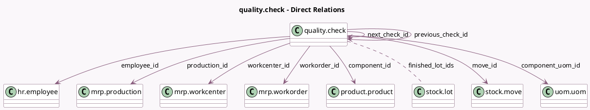

<!-- GENERATED:MODEL -->
---
tags: [odoo, enterprise, generated, model]
---

# quality.check

- Module: [[docs/Enterprise Addons/mrp_workorder/mrp_workorder|mrp_workorder]]
- Scope: Enterprise Addons
- Defined in module: extension only
- Source files: `models/quality.py`
- Python classes: `QualityCheck`

## Field footprint

- Detected fields: 21
- Field types: `Binary` x 1, `Boolean` x 2, `Char` x 3, `Float` x 1, `Many2many` x 1, `Many2one` x 9, `Selection` x 4
- Relation fields: 10

## Sample fields

- `component_barcode`: `Char` (related `component_id.barcode`)
- `component_id`: `Many2one` (comodel `product.product`)
- `component_tracking`: `Selection` (related `component_id.tracking`)
- `component_uom_id`: `Many2one` (comodel `uom.uom`, related `move_id.product_uom`)
- `consumption`: `Selection` (related `workorder_id.consumption`)
- `employee_id`: `Many2one` (comodel `hr.employee`)
- `finished_lot_ids`: `Many2many` (comodel `stock.lot`, related `production_id.lot_producing_ids`)
- `finished_product_sequence`: `Float` (comodel `Finished Product Sequence Number`)
- `is_deleted`: `Boolean` (comodel `Deleted in production`)
- `is_user_working`: `Boolean` (related `workorder_id.is_user_working`)
- `move_id`: `Many2one` (comodel `stock.move`)
- `next_check_id`: `Many2one` (comodel `quality.check`)
- `previous_check_id`: `Many2one` (comodel `quality.check`)
- `product_tracking`: `Selection` (related `production_id.product_tracking`)
- `production_id`: `Many2one` (comodel `mrp.production`)
- `result`: `Char` (comodel `Result`, compute `_compute_result`)
- `title`: `Char` (comodel `Title`, compute `_compute_title`)
- `workcenter_id`: `Many2one` (comodel `mrp.workcenter`, related `workorder_id.workcenter_id`)
- `working_state`: `Selection` (related `workorder_id.working_state`)
- `workorder_id`: `Many2one` (comodel `mrp.workorder`)

## Method hints

- Detected methods: 14
- Action methods: `action_next`, `action_print`
- Compute methods: `_compute_result`, `_compute_title`
- Onchange methods: none

## Direct relation diagram

## Navigation

- **Parent:** [[docs/Enterprise Addons/mrp_workorder/Models]]

<!-- GENERATED:MODEL -->
