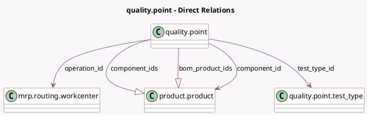

<!-- GENERATED:MODEL -->
---
tags: [odoo, enterprise, generated, model]
---

# quality.point

- Module: [[docs/Enterprise Addons/mrp_workorder/mrp_workorder|mrp_workorder]]
- Scope: Enterprise Addons
- Defined in module: extension only
- Source files: `models/quality.py`
- Python classes: `QualityPoint`

## Field footprint

- Detected fields: 11
- Field types: `Binary` x 1, `Boolean` x 2, `Many2many` x 1, `Many2one` x 4, `One2many` x 2, `Selection` x 1
- Relation fields: 7

## Sample fields

- `bom_active`: `Boolean` (comodel `Related Bill of Material Active`, related `bom_id.active`)
- `bom_id`: `Many2one` (related `operation_id.bom_id`)
- `bom_product_ids`: `One2many` (comodel `product.product`, compute `_compute_bom_product_ids`)
- `component_id`: `Many2one` (comodel `product.product`)
- `component_ids`: `One2many` (comodel `product.product`, compute `_compute_component_ids`)
- `is_workorder_step`: `Boolean` (compute `_compute_is_workorder_step`)
- `operation_id`: `Many2one` (comodel `mrp.routing.workcenter`)
- `product_ids`: `Many2many`
- `test_report_type`: `Selection`
- `test_type_id`: `Many2one` (comodel `quality.point.test_type`)
- `worksheet_document`: `Binary` (comodel `Image/PDF`)

## Method hints

- Detected methods: 11
- Action methods: `action_view_worksheet_document`
- Compute methods: `_compute_bom_product_ids`, `_compute_component_ids`, `_compute_is_workorder_step`, `_compute_show_failure_location`
- Onchange methods: `_onchange_bom_product_ids`, `_onchange_operation_id`, `_onchange_test_type_id`

## Direct relation diagram

## Navigation

- **Parent:** [[docs/Enterprise Addons/mrp_workorder/Models]]

<!-- GENERATED:MODEL -->
