<!-- GENERATED:MODEL -->
---
tags: [odoo, enterprise, generated, model]
---

# stock.move

- Module: [[docs/Enterprise Addons/mrp_workorder/mrp_workorder|mrp_workorder]]
- Scope: Enterprise Addons
- Defined in module: extension only
- Source files: `models/stock_move.py`
- Python classes: `StockMove`

## Field footprint

- Detected fields: 6
- Field types: `Binary` x 1, `Boolean` x 1, `Char` x 1, `Html` x 1, `One2many` x 2
- Relation fields: 2

## Sample fields

- `check_id`: `One2many` (comodel `quality.check`)
- `move_line_ids_picked`: `One2many` (comodel `stock.move.line`)
- `note`: `Html` (comodel `Note`, related `check_id.note`)
- `picking_type_prefill_shop_floor_lots`: `Boolean` (related `picking_type_id.prefill_shop_floor_lots`)
- `product_barcode`: `Char` (related `product_id.barcode`)
- `worksheet_document`: `Binary` (comodel `Worksheet Image/PDF`, compute `_compute_worksheet_document`)

## Method hints

- Detected methods: 12
- Action methods: `action_add_from_catalog_raw`, `action_add_from_quant`, `action_pass`, `action_undo`
- Compute methods: `_compute_manual_consumption`, `_compute_worksheet_document`
- Onchange methods: none

## Direct relation diagram

```plantuml
@startuml
!define ODOO_COLOR_PRIMARY #714B67
!define ODOO_COLOR_ACCENT #875A7B
!define ODOO_COLOR_BG #FAF7FA

skinparam backgroundColor ODOO_COLOR_BG
skinparam defaultTextAlignment left
skinparam ArrowColor ODOO_COLOR_ACCENT
skinparam ClassBackgroundColor white
skinparam ClassBorderColor ODOO_COLOR_PRIMARY
skinparam ComponentBackgroundColor white
skinparam ComponentBorderColor ODOO_COLOR_PRIMARY
skinparam NoteBackgroundColor #FFF8FF
skinparam NoteBorderColor ODOO_COLOR_ACCENT
skinparam SequenceLifeLineBorderColor ODOO_COLOR_ACCENT
skinparam SequenceLifeLineBackgroundColor #FFFFFF
skinparam SequenceParticipantBorderColor ODOO_COLOR_PRIMARY
skinparam SequenceParticipantBackgroundColor #FFFFFF
skinparam sequence {
  ArrowColor ODOO_COLOR_ACCENT
  ActorBorderColor ODOO_COLOR_PRIMARY
}
title stock.move - Direct Relations
class "stock.move" as stock_move
class "quality.check" as quality_check
class "stock.move.line" as stock_move_line
stock_move --|> quality_check : check_id
stock_move --|> stock_move_line : move_line_ids_picked
@enduml
```

## Navigation

- **Parent:** [[docs/Enterprise Addons/mrp_workorder/Models]]

<!-- GENERATED:MODEL -->
