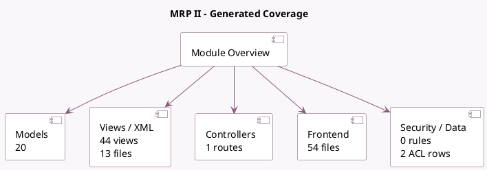

<!-- GENERATED:MODULE -->
---
tags: [odoo, enterprise, module]
---

# MRP II

- Scope: Enterprise Addons
- Source: enterprise/mrp_workorder
- Dependencies: [[docs/Enterprise Addons/quality/quality|quality]], [[docs/Community Addons/mrp/mrp|mrp]], [[docs/Community Addons/barcodes/barcodes|barcodes]], [[docs/Enterprise Addons/web_gantt/web_gantt|web_gantt]], [[docs/Community Addons/web_tour/web_tour|web_tour]], [[docs/Community Addons/hr_hourly_cost/hr_hourly_cost|hr_hourly_cost]]

## Summary

Work Orders, Planning, Stock Reports.

## Generated coverage

- Models: 20
- XML files with UI/data artifacts: 13
- Views: 44
- Actions: 18
- Menus: 6
- Rules (ir.rule): 0
- Access CSV entries: 2
- Controller units: 1
- Frontend asset files: 54

## Module map

## Detail notes

- Models: [[docs/Enterprise Addons/mrp_workorder/Models|Models]] (20)
- Views and XML: [[docs/Enterprise Addons/mrp_workorder/Views|Views]] (13 files)
- Controllers: [[docs/Enterprise Addons/mrp_workorder/Controllers|Controllers]] (1)
- Frontend: [[docs/Enterprise Addons/mrp_workorder/Frontend|Frontend]] (54 files)

## Key models

- `change.production.qty`
- `hr.employee`
- `mrp.bom`
- `mrp.production`
- `mrp.production.backorder`
- `mrp.routing.workcenter`
- `mrp.workcenter`
- `mrp.workcenter.productivity`
- `mrp.workorder`
- `mrp_production.additional.workorder`
- `propose.change`
- `quality.alert`

## Navigation

- [[../Enterprise Addons/Enterprise Addons|Back to scope]]
- [[../../docs/docs|Back to docs]]

<!-- GENERATED:MODULE -->

