<!-- GENERATED:MODEL -->
---
tags: [odoo, enterprise, generated, model]
---

# mrp.workorder

- Module: [[docs/Enterprise Addons/mrp_workorder_hr_account/mrp_workorder_hr_account|mrp_workorder_hr_account]]
- Scope: Enterprise Addons
- Defined in module: extension only
- Source files: `models/mrp_workorder.py`
- Python classes: `MrpWorkorder`

## Field footprint

- Detected fields: 1
- Field types: `Many2many` x 1
- Relation fields: 1

## Sample fields

- `employee_analytic_account_line_ids`: `Many2many` (comodel `account.analytic.line`)

## Method hints

- Detected methods: 2
- Action methods: `action_cancel`
- Compute methods: `_compute_duration`
- Onchange methods: none

## Direct relation diagram

```plantuml
@startuml
!define ODOO_COLOR_PRIMARY #714B67
!define ODOO_COLOR_ACCENT #875A7B
!define ODOO_COLOR_BG #FAF7FA

skinparam backgroundColor ODOO_COLOR_BG
skinparam defaultTextAlignment left
skinparam ArrowColor ODOO_COLOR_ACCENT
skinparam ClassBackgroundColor white
skinparam ClassBorderColor ODOO_COLOR_PRIMARY
skinparam ComponentBackgroundColor white
skinparam ComponentBorderColor ODOO_COLOR_PRIMARY
skinparam NoteBackgroundColor #FFF8FF
skinparam NoteBorderColor ODOO_COLOR_ACCENT
skinparam SequenceLifeLineBorderColor ODOO_COLOR_ACCENT
skinparam SequenceLifeLineBackgroundColor #FFFFFF
skinparam SequenceParticipantBorderColor ODOO_COLOR_PRIMARY
skinparam SequenceParticipantBackgroundColor #FFFFFF
skinparam sequence {
  ArrowColor ODOO_COLOR_ACCENT
  ActorBorderColor ODOO_COLOR_PRIMARY
}
title mrp.workorder - Direct Relations
class "mrp.workorder" as mrp_workorder
class "account.analytic.line" as account_analytic_line
mrp_workorder .. account_analytic_line : employee_analytic_account_line_ids
@enduml
```

## Navigation

- **Parent:** [[docs/Enterprise Addons/mrp_workorder_hr_account/Models]]

<!-- GENERATED:MODEL -->
