<!-- GENERATED:MODEL -->
---
tags: [odoo, enterprise, generated, model]
---

# iot.trigger

- Module: [[docs/Enterprise Addons/mrp_workorder_iot/mrp_workorder_iot|mrp_workorder_iot]]
- Scope: Enterprise Addons
- Defined in module: yes
- Source files: `models/mrp_workorder.py`
- Python classes: `IotTrigger`
- Description: IOT Trigger

## Field footprint

- Detected fields: 5
- Field types: `Char` x 1, `Integer` x 1, `Many2one` x 2, `Selection` x 1
- Relation fields: 2

## Sample fields

- `action`: `Selection`
- `device_id`: `Many2one` (comodel `iot.device`)
- `key`: `Char` (comodel `Key`)
- `sequence`: `Integer`
- `workcenter_id`: `Many2one` (comodel `mrp.workcenter`)

## Method hints

- Detected methods: 0
- Action methods: none
- Compute methods: none
- Onchange methods: none

## Direct relation diagram

```plantuml
@startuml
!define ODOO_COLOR_PRIMARY #714B67
!define ODOO_COLOR_ACCENT #875A7B
!define ODOO_COLOR_BG #FAF7FA

skinparam backgroundColor ODOO_COLOR_BG
skinparam defaultTextAlignment left
skinparam ArrowColor ODOO_COLOR_ACCENT
skinparam ClassBackgroundColor white
skinparam ClassBorderColor ODOO_COLOR_PRIMARY
skinparam ComponentBackgroundColor white
skinparam ComponentBorderColor ODOO_COLOR_PRIMARY
skinparam NoteBackgroundColor #FFF8FF
skinparam NoteBorderColor ODOO_COLOR_ACCENT
skinparam SequenceLifeLineBorderColor ODOO_COLOR_ACCENT
skinparam SequenceLifeLineBackgroundColor #FFFFFF
skinparam SequenceParticipantBorderColor ODOO_COLOR_PRIMARY
skinparam SequenceParticipantBackgroundColor #FFFFFF
skinparam sequence {
  ArrowColor ODOO_COLOR_ACCENT
  ActorBorderColor ODOO_COLOR_PRIMARY
}
title iot.trigger - Direct Relations
class "iot.trigger" as iot_trigger
class "iot.device" as iot_device
class "mrp.workcenter" as mrp_workcenter
iot_trigger --> iot_device : device_id
iot_trigger --> mrp_workcenter : workcenter_id
@enduml
```

## Navigation

- **Parent:** [[docs/Enterprise Addons/mrp_workorder_iot/Models]]

<!-- GENERATED:MODEL -->
