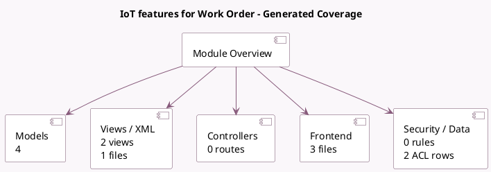

<!-- GENERATED:MODULE -->
---
tags: [odoo, enterprise, module]
---

# IoT features for Work Order

- Scope: Enterprise Addons
- Source: enterprise/mrp_workorder_iot
- Dependencies: [[docs/Enterprise Addons/mrp_workorder/mrp_workorder|mrp_workorder]], [[docs/Enterprise Addons/quality_iot/quality_iot|quality_iot]]

## Summary

Steps in MRP work orders with IoT devices

## Generated coverage

- Models: 4
- XML files with UI/data artifacts: 1
- Views: 2
- Actions: 0
- Menus: 0
- Rules (ir.rule): 0
- Access CSV entries: 2
- Controller units: 0
- Frontend asset files: 3

## Module map

## Detail notes

- Models: [[docs/Enterprise Addons/mrp_workorder_iot/Models|Models]] (4)
- Views and XML: [[docs/Enterprise Addons/mrp_workorder_iot/Views|Views]] (1 files)
- Frontend: [[docs/Enterprise Addons/mrp_workorder_iot/Frontend|Frontend]] (3 files)

## Key models

- `iot.device`
- `iot.trigger`
- `mrp.workcenter`
- `quality.check`

## Navigation

- [[../Enterprise Addons/Enterprise Addons|Back to scope]]
- [[../../docs/docs|Back to docs]]

<!-- GENERATED:MODULE -->

