<!-- GENERATED:MODEL -->
---
tags: [odoo, enterprise, generated, model]
---

# mrp.eco

- Module: [[docs/Enterprise Addons/mrp_workorder_plm/mrp_workorder_plm|mrp_workorder_plm]]
- Scope: Enterprise Addons
- Defined in module: extension only
- Source files: `models/mrp_eco.py`
- Python classes: `MrpEco`

## Field footprint

- Detected fields: 2
- Field types: `One2many` x 2
- Relation fields: 2

## Sample fields

- `routing_change_ids_on_operation`: `One2many` (comodel `mrp.eco.routing.change`)
- `routing_change_ids_on_quality_point`: `One2many` (comodel `mrp.eco.routing.change`)

## Method hints

- Detected methods: 2
- Action methods: none
- Compute methods: `_compute_routing_change_ids`
- Onchange methods: none

## Direct relation diagram

```plantuml
@startuml
!define ODOO_COLOR_PRIMARY #714B67
!define ODOO_COLOR_ACCENT #875A7B
!define ODOO_COLOR_BG #FAF7FA

skinparam backgroundColor ODOO_COLOR_BG
skinparam defaultTextAlignment left
skinparam ArrowColor ODOO_COLOR_ACCENT
skinparam ClassBackgroundColor white
skinparam ClassBorderColor ODOO_COLOR_PRIMARY
skinparam ComponentBackgroundColor white
skinparam ComponentBorderColor ODOO_COLOR_PRIMARY
skinparam NoteBackgroundColor #FFF8FF
skinparam NoteBorderColor ODOO_COLOR_ACCENT
skinparam SequenceLifeLineBorderColor ODOO_COLOR_ACCENT
skinparam SequenceLifeLineBackgroundColor #FFFFFF
skinparam SequenceParticipantBorderColor ODOO_COLOR_PRIMARY
skinparam SequenceParticipantBackgroundColor #FFFFFF
skinparam sequence {
  ArrowColor ODOO_COLOR_ACCENT
  ActorBorderColor ODOO_COLOR_PRIMARY
}
title mrp.eco - Direct Relations
class "mrp.eco" as mrp_eco
class "mrp.eco.routing.change" as mrp_eco_routing_change
mrp_eco --|> mrp_eco_routing_change : routing_change_ids_on_operation
mrp_eco --|> mrp_eco_routing_change : routing_change_ids_on_quality_point
@enduml
```

## Navigation

- **Parent:** [[docs/Enterprise Addons/mrp_workorder_plm/Models]]

<!-- GENERATED:MODEL -->
