<!-- GENERATED:MODEL -->
---
tags: [odoo, enterprise, generated, model]
---

# mrp.eco.routing.change

- Module: [[docs/Enterprise Addons/mrp_workorder_plm/mrp_workorder_plm|mrp_workorder_plm]]
- Scope: Enterprise Addons
- Defined in module: extension only
- Source files: `models/mrp_eco.py`
- Python classes: `MrpEcoRoutingChange`

## Field footprint

- Detected fields: 4
- Field types: `Char` x 2, `Many2one` x 2
- Relation fields: 2

## Sample fields

- `quality_point_id`: `Many2one` (comodel `quality.point`)
- `step`: `Char` (related `quality_point_id.name`)
- `test_type`: `Many2one` (comodel `quality.point.test_type`, related `quality_point_id.test_type_id`)
- `title`: `Char` (related `quality_point_id.title`)

## Method hints

- Detected methods: 1
- Action methods: `action_open_routing_change_quality_point`
- Compute methods: none
- Onchange methods: none

## Direct relation diagram

```plantuml
@startuml
!define ODOO_COLOR_PRIMARY #714B67
!define ODOO_COLOR_ACCENT #875A7B
!define ODOO_COLOR_BG #FAF7FA

skinparam backgroundColor ODOO_COLOR_BG
skinparam defaultTextAlignment left
skinparam ArrowColor ODOO_COLOR_ACCENT
skinparam ClassBackgroundColor white
skinparam ClassBorderColor ODOO_COLOR_PRIMARY
skinparam ComponentBackgroundColor white
skinparam ComponentBorderColor ODOO_COLOR_PRIMARY
skinparam NoteBackgroundColor #FFF8FF
skinparam NoteBorderColor ODOO_COLOR_ACCENT
skinparam SequenceLifeLineBorderColor ODOO_COLOR_ACCENT
skinparam SequenceLifeLineBackgroundColor #FFFFFF
skinparam SequenceParticipantBorderColor ODOO_COLOR_PRIMARY
skinparam SequenceParticipantBackgroundColor #FFFFFF
skinparam sequence {
  ArrowColor ODOO_COLOR_ACCENT
  ActorBorderColor ODOO_COLOR_PRIMARY
}
title mrp.eco.routing.change - Direct Relations
class "mrp.eco.routing.change" as mrp_eco_routing_change
class "quality.point" as quality_point
class "quality.point.test_type" as quality_point_test_type
mrp_eco_routing_change --> quality_point : quality_point_id
mrp_eco_routing_change --> quality_point_test_type : test_type
@enduml
```

## Navigation

- **Parent:** [[docs/Enterprise Addons/mrp_workorder_plm/Models]]

<!-- GENERATED:MODEL -->
