<!-- GENERATED:MODEL -->
---
tags: [odoo, enterprise, generated, model]
---

# commission.plan

- Module: [[docs/Enterprise Addons/partner_commission/partner_commission|partner_commission]]
- Scope: Enterprise Addons
- Defined in module: yes
- Source files: `models/commission_plan.py`
- Python classes: `CommissionPlan`
- Description: Commission plan

## Field footprint

- Detected fields: 5
- Field types: `Boolean` x 1, `Char` x 1, `Many2one` x 2, `One2many` x 1
- Relation fields: 3

## Sample fields

- `active`: `Boolean`
- `commission_rule_ids`: `One2many` (comodel `commission.rule`)
- `company_id`: `Many2one` (comodel `res.company`)
- `name`: `Char` (comodel `Name`)
- `product_id`: `Many2one` (comodel `product.product`)

## Method hints

- Detected methods: 1
- Action methods: none
- Compute methods: none
- Onchange methods: none

## Direct relation diagram

```plantuml
@startuml
!define ODOO_COLOR_PRIMARY #714B67
!define ODOO_COLOR_ACCENT #875A7B
!define ODOO_COLOR_BG #FAF7FA

skinparam backgroundColor ODOO_COLOR_BG
skinparam defaultTextAlignment left
skinparam ArrowColor ODOO_COLOR_ACCENT
skinparam ClassBackgroundColor white
skinparam ClassBorderColor ODOO_COLOR_PRIMARY
skinparam ComponentBackgroundColor white
skinparam ComponentBorderColor ODOO_COLOR_PRIMARY
skinparam NoteBackgroundColor #FFF8FF
skinparam NoteBorderColor ODOO_COLOR_ACCENT
skinparam SequenceLifeLineBorderColor ODOO_COLOR_ACCENT
skinparam SequenceLifeLineBackgroundColor #FFFFFF
skinparam SequenceParticipantBorderColor ODOO_COLOR_PRIMARY
skinparam SequenceParticipantBackgroundColor #FFFFFF
skinparam sequence {
  ArrowColor ODOO_COLOR_ACCENT
  ActorBorderColor ODOO_COLOR_PRIMARY
}
title commission.plan - Direct Relations
class "commission.plan" as commission_plan
class "commission.rule" as commission_rule
class "product.product" as product_product
class "res.company" as res_company
commission_plan --> product_product : product_id
commission_plan --|> commission_rule : commission_rule_ids
commission_plan --> res_company : company_id
@enduml
```

## Navigation

- **Parent:** [[docs/Enterprise Addons/partner_commission/Models]]

<!-- GENERATED:MODEL -->
