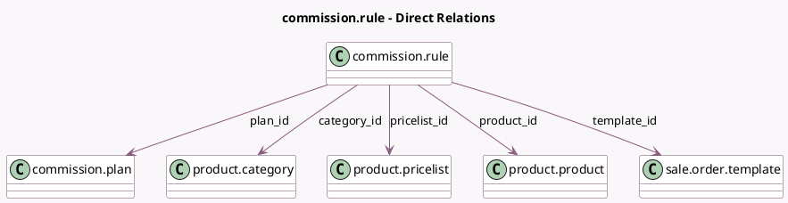

<!-- GENERATED:MODEL -->
---
tags: [odoo, enterprise, generated, model]
---

# commission.rule

- Module: [[docs/Enterprise Addons/partner_commission/partner_commission|partner_commission]]
- Scope: Enterprise Addons
- Defined in module: yes
- Source files: `models/commission_plan.py`
- Python classes: `CommissionRule`
- Description: Commission rules management.

## Field footprint

- Detected fields: 9
- Field types: `Boolean` x 1, `Float` x 2, `Integer` x 1, `Many2one` x 5
- Relation fields: 5

## Sample fields

- `category_id`: `Many2one` (comodel `product.category`)
- `is_capped`: `Boolean` (comodel `Capped`)
- `max_commission`: `Float` (comodel `Max Commission`)
- `plan_id`: `Many2one` (comodel `commission.plan`)
- `pricelist_id`: `Many2one` (comodel `product.pricelist`)
- `product_id`: `Many2one` (comodel `product.product`)
- `rate`: `Float` (comodel `Rate`)
- `sequence`: `Integer`
- `template_id`: `Many2one` (comodel `sale.order.template`)

## Method hints

- Detected methods: 2
- Action methods: none
- Compute methods: none
- Onchange methods: `_onchange_is_capped`

## Direct relation diagram

## Navigation

- **Parent:** [[docs/Enterprise Addons/partner_commission/Models]]

<!-- GENERATED:MODEL -->
