<!-- GENERATED:MODEL -->
---
tags: [odoo, enterprise, generated, model]
---

# sale.order

- Module: [[docs/Enterprise Addons/partner_commission/partner_commission|partner_commission]]
- Scope: Enterprise Addons
- Defined in module: extension only
- Source files: `models/sale_order.py`
- Python classes: `SaleOrder`

## Field footprint

- Detected fields: 4
- Field types: `Boolean` x 1, `Many2one` x 2, `Monetary` x 1
- Relation fields: 2

## Sample fields

- `commission`: `Monetary` (compute `_compute_commission`)
- `commission_plan_frozen`: `Boolean` (comodel `Freeze Plan`)
- `commission_plan_id`: `Many2one` (comodel `commission.plan`, compute `_compute_commission_plan`, store `True`)
- `referrer_id`: `Many2one` (comodel `res.partner`)

## Method hints

- Detected methods: 7
- Action methods: none
- Compute methods: `_compute_commission`, `_compute_commission_plan`
- Onchange methods: none

## Direct relation diagram

```plantuml
@startuml
!define ODOO_COLOR_PRIMARY #714B67
!define ODOO_COLOR_ACCENT #875A7B
!define ODOO_COLOR_BG #FAF7FA

skinparam backgroundColor ODOO_COLOR_BG
skinparam defaultTextAlignment left
skinparam ArrowColor ODOO_COLOR_ACCENT
skinparam ClassBackgroundColor white
skinparam ClassBorderColor ODOO_COLOR_PRIMARY
skinparam ComponentBackgroundColor white
skinparam ComponentBorderColor ODOO_COLOR_PRIMARY
skinparam NoteBackgroundColor #FFF8FF
skinparam NoteBorderColor ODOO_COLOR_ACCENT
skinparam SequenceLifeLineBorderColor ODOO_COLOR_ACCENT
skinparam SequenceLifeLineBackgroundColor #FFFFFF
skinparam SequenceParticipantBorderColor ODOO_COLOR_PRIMARY
skinparam SequenceParticipantBackgroundColor #FFFFFF
skinparam sequence {
  ArrowColor ODOO_COLOR_ACCENT
  ActorBorderColor ODOO_COLOR_PRIMARY
}
title sale.order - Direct Relations
class "sale.order" as sale_order
class "commission.plan" as commission_plan
class "res.partner" as res_partner
sale_order --> res_partner : referrer_id
sale_order --> commission_plan : commission_plan_id
@enduml
```

## Navigation

- **Parent:** [[docs/Enterprise Addons/partner_commission/Models]]

<!-- GENERATED:MODEL -->
