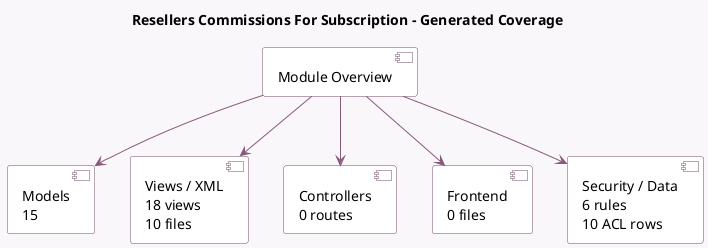

<!-- GENERATED:MODULE -->
---
tags: [odoo, enterprise, module]
---

# Resellers Commissions For Subscription

- Scope: Enterprise Addons
- Source: enterprise/partner_commission
- Dependencies: [[docs/Community Addons/purchase/purchase|purchase]], [[docs/Enterprise Addons/sale_subscription_partnership/sale_subscription_partnership|sale_subscription_partnership]], [[docs/Community Addons/website_crm_partner_assign/website_crm_partner_assign|website_crm_partner_assign]]

## Summary

Configure resellers commissions on subscription sale

## Generated coverage

- Models: 15
- XML files with UI/data artifacts: 10
- Views: 18
- Actions: 4
- Menus: 1
- Rules (ir.rule): 6
- Access CSV entries: 10
- Controller units: 0
- Frontend asset files: 0

## Module map

## Detail notes

- Models: [[docs/Enterprise Addons/partner_commission/Models|Models]] (15)
- Views and XML: [[docs/Enterprise Addons/partner_commission/Views|Views]] (10 files)

## Key models

- `account.move`
- `account.move.line`
- `commission.plan`
- `commission.rule`
- `crm.lead`
- `purchase.order`
- `res.company`
- `res.config.settings`
- `res.partner`
- `res.partner.grade`
- `sale.order`
- `sale.order.line`

## Navigation

- [[../Enterprise Addons/Enterprise Addons|Back to scope]]
- [[../../docs/docs|Back to docs]]

<!-- GENERATED:MODULE -->

