<!-- GENERATED:MODEL -->
---
tags: [odoo, enterprise, generated, model]
---

# sdd.mandate

- Module: [[docs/Enterprise Addons/payment_sepa_direct_debit/payment_sepa_direct_debit|payment_sepa_direct_debit]]
- Scope: Enterprise Addons
- Defined in module: extension only
- Source files: `models/sdd_mandate.py`
- Python classes: `SddMandate`

## Field footprint

- Detected fields: 3
- Field types: `Boolean` x 1, `Integer` x 1, `One2many` x 1
- Relation fields: 1

## Sample fields

- `is_online_payment`: `Boolean` (compute `_compute_is_online_payment`)
- `payment_transaction_count`: `Integer` (compute `_compute_payment_transaction_count`)
- `payment_transaction_ids`: `One2many` (comodel `payment.transaction`)

## Method hints

- Detected methods: 7
- Action methods: `action_validate_mandate`, `action_view_payment_transactions`
- Compute methods: `_compute_is_online_payment`, `_compute_payment_transaction_count`
- Onchange methods: none

## Direct relation diagram

```plantuml
@startuml
!define ODOO_COLOR_PRIMARY #714B67
!define ODOO_COLOR_ACCENT #875A7B
!define ODOO_COLOR_BG #FAF7FA

skinparam backgroundColor ODOO_COLOR_BG
skinparam defaultTextAlignment left
skinparam ArrowColor ODOO_COLOR_ACCENT
skinparam ClassBackgroundColor white
skinparam ClassBorderColor ODOO_COLOR_PRIMARY
skinparam ComponentBackgroundColor white
skinparam ComponentBorderColor ODOO_COLOR_PRIMARY
skinparam NoteBackgroundColor #FFF8FF
skinparam NoteBorderColor ODOO_COLOR_ACCENT
skinparam SequenceLifeLineBorderColor ODOO_COLOR_ACCENT
skinparam SequenceLifeLineBackgroundColor #FFFFFF
skinparam SequenceParticipantBorderColor ODOO_COLOR_PRIMARY
skinparam SequenceParticipantBackgroundColor #FFFFFF
skinparam sequence {
  ArrowColor ODOO_COLOR_ACCENT
  ActorBorderColor ODOO_COLOR_PRIMARY
}
title sdd.mandate - Direct Relations
class "sdd.mandate" as sdd_mandate
class "payment.transaction" as payment_transaction
sdd_mandate --|> payment_transaction : payment_transaction_ids
@enduml
```

## Navigation

- **Parent:** [[docs/Enterprise Addons/payment_sepa_direct_debit/Models]]

<!-- GENERATED:MODEL -->
