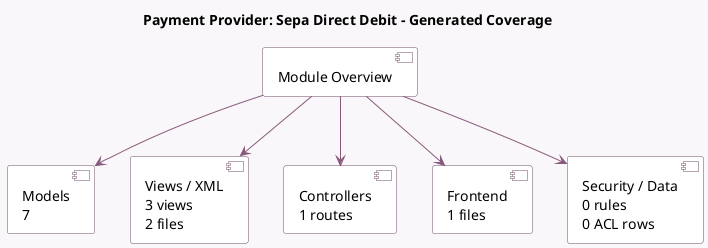

<!-- GENERATED:MODULE -->
---
tags: [odoo, enterprise, module]
---

# Payment Provider: Sepa Direct Debit

- Scope: Enterprise Addons
- Source: enterprise/payment_sepa_direct_debit
- Dependencies: [[docs/Enterprise Addons/account_sepa_direct_debit/account_sepa_direct_debit|account_sepa_direct_debit]], [[docs/Community Addons/account_payment/account_payment|account_payment]], [[docs/Community Addons/payment_custom/payment_custom|payment_custom]]

## Summary

A payment provider for enabling Sepa Direct Debit in the EU.

## Generated coverage

- Models: 7
- XML files with UI/data artifacts: 2
- Views: 3
- Actions: 0
- Menus: 0
- Rules (ir.rule): 0
- Access CSV entries: 0
- Controller units: 1
- Frontend asset files: 1

## Module map

## Detail notes

- Models: [[docs/Enterprise Addons/payment_sepa_direct_debit/Models|Models]] (7)
- Views and XML: [[docs/Enterprise Addons/payment_sepa_direct_debit/Views|Views]] (2 files)
- Controllers: [[docs/Enterprise Addons/payment_sepa_direct_debit/Controllers|Controllers]] (1)
- Frontend: [[docs/Enterprise Addons/payment_sepa_direct_debit/Frontend|Frontend]] (1 files)

## Key models

- `account.bank.statement.line`
- `account.payment.method`
- `payment.provider`
- `payment.token`
- `payment.transaction`
- `res.partner`
- `sdd.mandate`

## Navigation

- [[../Enterprise Addons/Enterprise Addons|Back to scope]]
- [[../../docs/docs|Back to docs]]

<!-- GENERATED:MODULE -->

