<!-- GENERATED:MODEL -->
---
tags: [odoo, enterprise, generated, model]
---

# hr.employee

- Module: [[docs/Enterprise Addons/planning/planning|planning]]
- Scope: Enterprise Addons
- Defined in module: extension only
- Source files: `models/hr.py`
- Python classes: `HrEmployee`

## Field footprint

- Detected fields: 4
- Field types: `Boolean` x 1, `Char` x 1, `Many2many` x 1, `Many2one` x 1
- Relation fields: 2

## Sample fields

- `default_planning_role_id`: `Many2one` (related `resource_id.default_role_id`)
- `employee_token`: `Char` (comodel `Security Token`)
- `has_slots`: `Boolean` (compute `_compute_has_slots`)
- `planning_role_ids`: `Many2many` (related `resource_id.role_ids`)

## Method hints

- Detected methods: 9
- Action methods: `action_archive`, `action_view_planning`
- Compute methods: `_compute_display_name`, `_compute_has_slots`
- Onchange methods: `_onchange_default_planning_role_id`, `_onchange_planning_role_ids`

## Direct relation diagram

```plantuml
@startuml
!define ODOO_COLOR_PRIMARY #714B67
!define ODOO_COLOR_ACCENT #875A7B
!define ODOO_COLOR_BG #FAF7FA

skinparam backgroundColor ODOO_COLOR_BG
skinparam defaultTextAlignment left
skinparam ArrowColor ODOO_COLOR_ACCENT
skinparam ClassBackgroundColor white
skinparam ClassBorderColor ODOO_COLOR_PRIMARY
skinparam ComponentBackgroundColor white
skinparam ComponentBorderColor ODOO_COLOR_PRIMARY
skinparam NoteBackgroundColor #FFF8FF
skinparam NoteBorderColor ODOO_COLOR_ACCENT
skinparam SequenceLifeLineBorderColor ODOO_COLOR_ACCENT
skinparam SequenceLifeLineBackgroundColor #FFFFFF
skinparam SequenceParticipantBorderColor ODOO_COLOR_PRIMARY
skinparam SequenceParticipantBackgroundColor #FFFFFF
skinparam sequence {
  ArrowColor ODOO_COLOR_ACCENT
  ActorBorderColor ODOO_COLOR_PRIMARY
}
title hr.employee - Direct Relations
class "hr.employee" as hr_employee
@enduml
```

## Navigation

- **Parent:** [[docs/Enterprise Addons/planning/Models]]

<!-- GENERATED:MODEL -->
