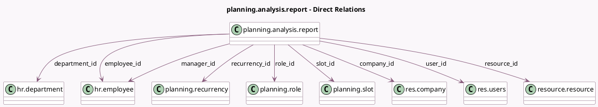

<!-- GENERATED:MODEL -->
---
tags: [odoo, enterprise, generated, model]
---

# planning.analysis.report

- Module: [[docs/Enterprise Addons/planning/planning|planning]]
- Scope: Enterprise Addons
- Defined in module: yes
- Source files: `report/planning_analysis_report.py`
- Python classes: `PlanningAnalysisReport`
- Description: Planning Analysis Report

## Field footprint

- Detected fields: 19
- Field types: `Boolean` x 2, `Char` x 1, `Datetime` x 2, `Float` x 2, `Many2one` x 9, `Selection` x 2, `Text` x 1
- Relation fields: 9

## Sample fields

- `allocated_hours`: `Float` (comodel `Allocated Time`)
- `allocated_percentage`: `Float` (comodel `Allocated Time (%)`)
- `company_id`: `Many2one` (comodel `res.company`)
- `department_id`: `Many2one` (comodel `hr.department`)
- `employee_id`: `Many2one` (comodel `hr.employee`)
- `end_datetime`: `Datetime` (comodel `End Date`)
- `job_title`: `Char` (comodel `Job Title`)
- `manager_id`: `Many2one` (comodel `hr.employee`)
- `name`: `Text` (comodel `Note`)
- `publication_warning`: `Boolean` (comodel `Modified Since Last Publication`)
- `recurrency_id`: `Many2one` (comodel `planning.recurrency`)
- `request_to_switch`: `Boolean` (comodel `Has there been a request to switch on this shift slot?`)
- `resource_id`: `Many2one` (comodel `resource.resource`)
- `resource_type`: `Selection`
- `role_id`: `Many2one` (comodel `planning.role`)
- `slot_id`: `Many2one` (comodel `planning.slot`)
- `start_datetime`: `Datetime` (comodel `Start Date`)
- `state`: `Selection`
- `user_id`: `Many2one` (comodel `res.users`)

## Method hints

- Detected methods: 6
- Action methods: none
- Compute methods: none
- Onchange methods: none

## Direct relation diagram

## Navigation

- **Parent:** [[docs/Enterprise Addons/planning/Models]]

<!-- GENERATED:MODEL -->
