<!-- GENERATED:MODEL -->
---
tags: [odoo, enterprise, generated, model]
---

# planning.calendar.resource

- Module: [[docs/Enterprise Addons/planning/planning|planning]]
- Scope: Enterprise Addons
- Defined in module: yes
- Source files: `models/planning_calendar_resource.py`
- Python classes: `PlanningCalendarResource`
- Description: planning calendar resource

## Field footprint

- Detected fields: 5
- Field types: `Boolean` x 2, `Many2one` x 2, `Selection` x 1
- Relation fields: 2

## Sample fields

- `active`: `Boolean` (comodel `Active`)
- `checked`: `Boolean`
- `resource_id`: `Many2one` (comodel `resource.resource`)
- `resource_type`: `Selection` (related `resource_id.resource_type`)
- `user_id`: `Many2one` (comodel `res.users`)

## Method hints

- Detected methods: 1
- Action methods: none
- Compute methods: none
- Onchange methods: none

## Direct relation diagram

```plantuml
@startuml
!define ODOO_COLOR_PRIMARY #714B67
!define ODOO_COLOR_ACCENT #875A7B
!define ODOO_COLOR_BG #FAF7FA

skinparam backgroundColor ODOO_COLOR_BG
skinparam defaultTextAlignment left
skinparam ArrowColor ODOO_COLOR_ACCENT
skinparam ClassBackgroundColor white
skinparam ClassBorderColor ODOO_COLOR_PRIMARY
skinparam ComponentBackgroundColor white
skinparam ComponentBorderColor ODOO_COLOR_PRIMARY
skinparam NoteBackgroundColor #FFF8FF
skinparam NoteBorderColor ODOO_COLOR_ACCENT
skinparam SequenceLifeLineBorderColor ODOO_COLOR_ACCENT
skinparam SequenceLifeLineBackgroundColor #FFFFFF
skinparam SequenceParticipantBorderColor ODOO_COLOR_PRIMARY
skinparam SequenceParticipantBackgroundColor #FFFFFF
skinparam sequence {
  ArrowColor ODOO_COLOR_ACCENT
  ActorBorderColor ODOO_COLOR_PRIMARY
}
title planning.calendar.resource - Direct Relations
class "planning.calendar.resource" as planning_calendar_resource
class "res.users" as res_users
class "resource.resource" as resource_resource
planning_calendar_resource --> res_users : user_id
planning_calendar_resource --> resource_resource : resource_id
@enduml
```

## Navigation

- **Parent:** [[docs/Enterprise Addons/planning/Models]]

<!-- GENERATED:MODEL -->
