<!-- GENERATED:MODEL -->
---
tags: [odoo, enterprise, generated, model]
---

# planning.planning

- Module: [[docs/Enterprise Addons/planning/planning|planning]]
- Scope: Enterprise Addons
- Defined in module: yes
- Source files: `models/planning_planning.py`
- Python classes: `PlanningPlanning`
- Description: Schedule

## Field footprint

- Detected fields: 10
- Field types: `Boolean` x 3, `Char` x 1, `Date` x 2, `Datetime` x 2, `Integer` x 1, `Many2one` x 1
- Relation fields: 1

## Sample fields

- `access_token`: `Char` (comodel `Security Token`)
- `allow_self_unassign`: `Boolean` (comodel `Let Employee Unassign Themselves`, compute `_compute_allow_self_unassign`)
- `company_id`: `Many2one` (comodel `res.company`)
- `date_end`: `Date` (comodel `Date End`, compute `_compute_dates`)
- `date_start`: `Date` (comodel `Date Start`, compute `_compute_dates`)
- `end_datetime`: `Datetime` (comodel `Stop Date`)
- `include_unassigned`: `Boolean` (comodel `Includes Open Shifts`)
- `is_planning_preview`: `Boolean`
- `self_unassign_days_before`: `Integer` (comodel `Days before shift for unassignment`, related `company_id.planning_self_unassign_days_before`)
- `start_datetime`: `Datetime` (comodel `Start Date`)

## Method hints

- Detected methods: 9
- Action methods: none
- Compute methods: `_compute_allow_self_unassign`, `_compute_dates`, `_compute_display_name`
- Onchange methods: none

## Direct relation diagram

```plantuml
@startuml
!define ODOO_COLOR_PRIMARY #714B67
!define ODOO_COLOR_ACCENT #875A7B
!define ODOO_COLOR_BG #FAF7FA

skinparam backgroundColor ODOO_COLOR_BG
skinparam defaultTextAlignment left
skinparam ArrowColor ODOO_COLOR_ACCENT
skinparam ClassBackgroundColor white
skinparam ClassBorderColor ODOO_COLOR_PRIMARY
skinparam ComponentBackgroundColor white
skinparam ComponentBorderColor ODOO_COLOR_PRIMARY
skinparam NoteBackgroundColor #FFF8FF
skinparam NoteBorderColor ODOO_COLOR_ACCENT
skinparam SequenceLifeLineBorderColor ODOO_COLOR_ACCENT
skinparam SequenceLifeLineBackgroundColor #FFFFFF
skinparam SequenceParticipantBorderColor ODOO_COLOR_PRIMARY
skinparam SequenceParticipantBackgroundColor #FFFFFF
skinparam sequence {
  ArrowColor ODOO_COLOR_ACCENT
  ActorBorderColor ODOO_COLOR_PRIMARY
}
title planning.planning - Direct Relations
class "planning.planning" as planning_planning
class "res.company" as res_company
planning_planning --> res_company : company_id
@enduml
```

## Navigation

- **Parent:** [[docs/Enterprise Addons/planning/Models]]

<!-- GENERATED:MODEL -->
