<!-- GENERATED:MODEL -->
---
tags: [odoo, enterprise, generated, model]
---

# planning.preview

- Module: [[docs/Enterprise Addons/planning/planning|planning]]
- Scope: Enterprise Addons
- Defined in module: yes
- Source files: `wizard/planning_preview.py`
- Python classes: `PlanningPreview`
- Description: Planning Preview

## Field footprint

- Detected fields: 2
- Field types: `Integer` x 1, `Many2one` x 1
- Relation fields: 1

## Sample fields

- `employee_id`: `Many2one` (comodel `hr.employee`)
- `slot_count`: `Integer` (compute `_compute_slot_count`)

## Method hints

- Detected methods: 3
- Action methods: `action_preview_shift`
- Compute methods: `_compute_slot_count`
- Onchange methods: none

## Direct relation diagram

```plantuml
@startuml
!define ODOO_COLOR_PRIMARY #714B67
!define ODOO_COLOR_ACCENT #875A7B
!define ODOO_COLOR_BG #FAF7FA

skinparam backgroundColor ODOO_COLOR_BG
skinparam defaultTextAlignment left
skinparam ArrowColor ODOO_COLOR_ACCENT
skinparam ClassBackgroundColor white
skinparam ClassBorderColor ODOO_COLOR_PRIMARY
skinparam ComponentBackgroundColor white
skinparam ComponentBorderColor ODOO_COLOR_PRIMARY
skinparam NoteBackgroundColor #FFF8FF
skinparam NoteBorderColor ODOO_COLOR_ACCENT
skinparam SequenceLifeLineBorderColor ODOO_COLOR_ACCENT
skinparam SequenceLifeLineBackgroundColor #FFFFFF
skinparam SequenceParticipantBorderColor ODOO_COLOR_PRIMARY
skinparam SequenceParticipantBackgroundColor #FFFFFF
skinparam sequence {
  ArrowColor ODOO_COLOR_ACCENT
  ActorBorderColor ODOO_COLOR_PRIMARY
}
title planning.preview - Direct Relations
class "planning.preview" as planning_preview
class "hr.employee" as hr_employee
planning_preview --> hr_employee : employee_id
@enduml
```

## Navigation

- **Parent:** [[docs/Enterprise Addons/planning/Models]]

<!-- GENERATED:MODEL -->
