<!-- GENERATED:MODEL -->
---
tags: [odoo, enterprise, generated, model]
---

# planning.recurrency

- Module: [[docs/Enterprise Addons/planning/planning|planning]]
- Scope: Enterprise Addons
- Defined in module: yes
- Source files: `models/planning_recurrency.py`
- Python classes: `PlanningRecurrency`
- Description: Planning Recurrence

## Field footprint

- Detected fields: 8
- Field types: `Datetime` x 2, `Integer` x 2, `Many2one` x 1, `One2many` x 1, `Selection` x 2
- Relation fields: 2

## Sample fields

- `company_id`: `Many2one` (comodel `res.company`)
- `last_generated_end_datetime`: `Datetime`
- `repeat_interval`: `Integer` (comodel `Repeat Every`)
- `repeat_number`: `Integer`
- `repeat_type`: `Selection`
- `repeat_unit`: `Selection`
- `repeat_until`: `Datetime`
- `slot_ids`: `One2many` (comodel `planning.slot`)

## Method hints

- Detected methods: 7
- Action methods: none
- Compute methods: `_compute_display_name`
- Onchange methods: none

## Direct relation diagram

```plantuml
@startuml
!define ODOO_COLOR_PRIMARY #714B67
!define ODOO_COLOR_ACCENT #875A7B
!define ODOO_COLOR_BG #FAF7FA

skinparam backgroundColor ODOO_COLOR_BG
skinparam defaultTextAlignment left
skinparam ArrowColor ODOO_COLOR_ACCENT
skinparam ClassBackgroundColor white
skinparam ClassBorderColor ODOO_COLOR_PRIMARY
skinparam ComponentBackgroundColor white
skinparam ComponentBorderColor ODOO_COLOR_PRIMARY
skinparam NoteBackgroundColor #FFF8FF
skinparam NoteBorderColor ODOO_COLOR_ACCENT
skinparam SequenceLifeLineBorderColor ODOO_COLOR_ACCENT
skinparam SequenceLifeLineBackgroundColor #FFFFFF
skinparam SequenceParticipantBorderColor ODOO_COLOR_PRIMARY
skinparam SequenceParticipantBackgroundColor #FFFFFF
skinparam sequence {
  ArrowColor ODOO_COLOR_ACCENT
  ActorBorderColor ODOO_COLOR_PRIMARY
}
title planning.recurrency - Direct Relations
class "planning.recurrency" as planning_recurrency
class "planning.slot" as planning_slot
class "res.company" as res_company
planning_recurrency --|> planning_slot : slot_ids
planning_recurrency --> res_company : company_id
@enduml
```

## Navigation

- **Parent:** [[docs/Enterprise Addons/planning/Models]]

<!-- GENERATED:MODEL -->
