<!-- GENERATED:MODEL -->
---
tags: [odoo, enterprise, generated, model]
---

# planning.role

- Module: [[docs/Enterprise Addons/planning/planning|planning]]
- Scope: Enterprise Addons
- Defined in module: yes
- Source files: `models/planning_role.py`
- Python classes: `PlanningRole`
- Description: Planning Role

## Field footprint

- Detected fields: 6
- Field types: `Boolean` x 1, `Char` x 1, `Integer` x 2, `Many2many` x 1, `PropertiesDefinition` x 1
- Relation fields: 1

## Sample fields

- `active`: `Boolean` (comodel `Active`)
- `color`: `Integer` (comodel `Color`)
- `name`: `Char` (comodel `Name`)
- `resource_ids`: `Many2many` (comodel `resource.resource`)
- `sequence`: `Integer`
- `slot_properties_definition`: `PropertiesDefinition` (comodel `Planning Slot Properties`)

## Method hints

- Detected methods: 4
- Action methods: none
- Compute methods: none
- Onchange methods: none

## Direct relation diagram

```plantuml
@startuml
!define ODOO_COLOR_PRIMARY #714B67
!define ODOO_COLOR_ACCENT #875A7B
!define ODOO_COLOR_BG #FAF7FA

skinparam backgroundColor ODOO_COLOR_BG
skinparam defaultTextAlignment left
skinparam ArrowColor ODOO_COLOR_ACCENT
skinparam ClassBackgroundColor white
skinparam ClassBorderColor ODOO_COLOR_PRIMARY
skinparam ComponentBackgroundColor white
skinparam ComponentBorderColor ODOO_COLOR_PRIMARY
skinparam NoteBackgroundColor #FFF8FF
skinparam NoteBorderColor ODOO_COLOR_ACCENT
skinparam SequenceLifeLineBorderColor ODOO_COLOR_ACCENT
skinparam SequenceLifeLineBackgroundColor #FFFFFF
skinparam SequenceParticipantBorderColor ODOO_COLOR_PRIMARY
skinparam SequenceParticipantBackgroundColor #FFFFFF
skinparam sequence {
  ArrowColor ODOO_COLOR_ACCENT
  ActorBorderColor ODOO_COLOR_PRIMARY
}
title planning.role - Direct Relations
class "planning.role" as planning_role
class "resource.resource" as resource_resource
planning_role .. resource_resource : resource_ids
@enduml
```

## Navigation

- **Parent:** [[docs/Enterprise Addons/planning/Models]]

<!-- GENERATED:MODEL -->
