<!-- GENERATED:MODEL -->
---
tags: [odoo, enterprise, generated, model]
---

# planning.send

- Module: [[docs/Enterprise Addons/planning/planning|planning]]
- Scope: Enterprise Addons
- Defined in module: yes
- Source files: `wizard/planning_send.py`
- Python classes: `PlanningSend`
- Description: Send Planning
- Inherits: `hr.mixin`

## Field footprint

- Detected fields: 7
- Field types: `Boolean` x 1, `Datetime` x 2, `Many2many` x 3, `Text` x 1
- Relation fields: 3

## Sample fields

- `employee_ids`: `Many2many` (comodel `hr.employee`, compute `_compute_slots_data`, store `True`)
- `employees_no_email`: `Many2many` (comodel `hr.employee`, compute `_compute_employees_no_email`)
- `end_datetime`: `Datetime` (comodel `Stop Date`)
- `include_unassigned`: `Boolean` (comodel `Include Open Shifts`)
- `note`: `Text` (comodel `Extra Message`)
- `slot_ids`: `Many2many` (comodel `planning.slot`, compute `_compute_slots_data`, store `True`)
- `start_datetime`: `Datetime` (comodel `Period`)

## Method hints

- Detected methods: 9
- Action methods: `action_check_emails`, `action_send`
- Compute methods: `_compute_employees_no_email`, `_compute_slots_data`
- Onchange methods: none

## Direct relation diagram

```plantuml
@startuml
!define ODOO_COLOR_PRIMARY #714B67
!define ODOO_COLOR_ACCENT #875A7B
!define ODOO_COLOR_BG #FAF7FA

skinparam backgroundColor ODOO_COLOR_BG
skinparam defaultTextAlignment left
skinparam ArrowColor ODOO_COLOR_ACCENT
skinparam ClassBackgroundColor white
skinparam ClassBorderColor ODOO_COLOR_PRIMARY
skinparam ComponentBackgroundColor white
skinparam ComponentBorderColor ODOO_COLOR_PRIMARY
skinparam NoteBackgroundColor #FFF8FF
skinparam NoteBorderColor ODOO_COLOR_ACCENT
skinparam SequenceLifeLineBorderColor ODOO_COLOR_ACCENT
skinparam SequenceLifeLineBackgroundColor #FFFFFF
skinparam SequenceParticipantBorderColor ODOO_COLOR_PRIMARY
skinparam SequenceParticipantBackgroundColor #FFFFFF
skinparam sequence {
  ArrowColor ODOO_COLOR_ACCENT
  ActorBorderColor ODOO_COLOR_PRIMARY
}
title planning.send - Direct Relations
class "planning.send" as planning_send
class "hr.employee" as hr_employee
class "planning.slot" as planning_slot
planning_send .. hr_employee : employee_ids
planning_send .. planning_slot : slot_ids
planning_send .. hr_employee : employees_no_email
@enduml
```

## Navigation

- **Parent:** [[docs/Enterprise Addons/planning/Models]]

<!-- GENERATED:MODEL -->
