<!-- GENERATED:MODEL -->
---
tags: [odoo, enterprise, generated, model]
---

# planning.slot

- Module: [[docs/Enterprise Addons/planning/planning|planning]]
- Scope: Enterprise Addons
- Defined in module: yes
- Source files: `models/planning_slot.py`
- Python classes: `PlanningSlot`
- Description: Planning Shift

## Field footprint

- Detected fields: 51
- Field types: `Boolean` x 13, `Char` x 3, `Date` x 1, `Datetime` x 3, `Float` x 3, `Integer` x 6, `Many2many` x 3, `Many2one` x 11, `Properties` x 1, `Selection` x 6, `Text` x 1
- Relation fields: 14

## Sample fields

- `access_token`: `Char`
- `allocated_hours`: `Float` (comodel `Allocated Time`, compute `_compute_allocated_hours`, store `True`)
- `allocated_percentage`: `Float` (comodel `Allocated Time %`, compute `_compute_allocated_percentage`, store `True`)
- `allocation_type`: `Selection` (compute `_compute_allocation_type`)
- `allow_self_unassign`: `Boolean` (comodel `Let Employee Unassign Themselves`, compute `_compute_allow_self_unassign`)
- `allow_template_creation`: `Boolean` (compute `_compute_allow_template_creation`)
- `color`: `Integer` (comodel `Color`, compute `_compute_color`)
- `company_id`: `Many2one` (comodel `res.company`, compute `_compute_planning_slot_company_id`, store `True`)
- `confirm_delete`: `Boolean` (compute `_compute_confirm_delete`)
- `conflicting_slot_ids`: `Many2many` (comodel `planning.slot`, compute `_compute_overlap_slot_count`)
- `department_id`: `Many2one` (related `employee_id.department_id`, store `True`)
- `duration`: `Float` (comodel `Duration`, compute `_compute_slot_duration`)
- `employee_id`: `Many2one` (comodel `hr.employee`, compute `_compute_employee_id`, store `True`)
- `end_datetime`: `Datetime` (comodel `End Date`, compute `_compute_datetime`, store `True`)
- `is_hatched`: `Boolean` (compute `_compute_is_hatched`)
- `is_past`: `Boolean` (comodel `Is This Shift In The Past?`, compute `_compute_past_shift`)
- `is_unassign_deadline_passed`: `Boolean` (compute `_compute_is_unassign_deadline_passed`)
- `is_users_role`: `Boolean` (comodel `Is the shifts role one of the current user roles`, compute `_compute_is_users_role`)
- `job_title`: `Char` (related `employee_id.job_title`)
- `manager_id`: `Many2one` (related `employee_id.parent_id`, store `True`)

## Method hints

- Detected methods: 114
- Action methods: `action_address_recurrency`, `action_cancel_switch`, `action_copy_previous_week`, `action_planning_publish_and_send`, `action_print_plannings`, `action_rollback_auto_plan_ids`, `action_rollback_copy_previous_week`, `action_save_template`, and 7 more
- Compute methods: `_compute_allocated_hours`, `_compute_allocated_percentage`, `_compute_allocation_type`, `_compute_allow_self_unassign`, `_compute_allow_template_creation`, `_compute_color`, `_compute_confirm_delete`, `_compute_datetime`, and 20 more
- Onchange methods: `_onchange_repeat_until`

## Direct relation diagram

```plantuml
@startuml
!define ODOO_COLOR_PRIMARY #714B67
!define ODOO_COLOR_ACCENT #875A7B
!define ODOO_COLOR_BG #FAF7FA

skinparam backgroundColor ODOO_COLOR_BG
skinparam defaultTextAlignment left
skinparam ArrowColor ODOO_COLOR_ACCENT
skinparam ClassBackgroundColor white
skinparam ClassBorderColor ODOO_COLOR_PRIMARY
skinparam ComponentBackgroundColor white
skinparam ComponentBorderColor ODOO_COLOR_PRIMARY
skinparam NoteBackgroundColor #FFF8FF
skinparam NoteBorderColor ODOO_COLOR_ACCENT
skinparam SequenceLifeLineBorderColor ODOO_COLOR_ACCENT
skinparam SequenceLifeLineBackgroundColor #FFFFFF
skinparam SequenceParticipantBorderColor ODOO_COLOR_PRIMARY
skinparam SequenceParticipantBackgroundColor #FFFFFF
skinparam sequence {
  ArrowColor ODOO_COLOR_ACCENT
  ActorBorderColor ODOO_COLOR_PRIMARY
}
title planning.slot - Direct Relations
class "planning.slot" as planning_slot
class "hr.employee" as hr_employee
class "planning.recurrency" as planning_recurrency
class "planning.role" as planning_role
class "planning.slot" as planning_slot
class "planning.slot.template" as planning_slot_template
class "res.company" as res_company
class "res.users" as res_users
class "resource.resource" as resource_resource
planning_slot --> resource_resource : resource_id
planning_slot --> hr_employee : employee_id
planning_slot --> res_users : user_id
planning_slot --> res_company : company_id
planning_slot --> planning_role : role_id
planning_slot .. planning_slot : conflicting_slot_ids
planning_slot .. planning_slot_template : template_autocomplete_ids
planning_slot --> planning_slot_template : template_id
planning_slot --> planning_slot_template : previous_template_id
planning_slot --> planning_recurrency : recurrency_id
@enduml
```

## Navigation

- **Parent:** [[docs/Enterprise Addons/planning/Models]]

<!-- GENERATED:MODEL -->
