<!-- GENERATED:MODEL -->
---
tags: [odoo, enterprise, generated, model]
---

# planning.slot.template

- Module: [[docs/Enterprise Addons/planning/planning|planning]]
- Scope: Enterprise Addons
- Defined in module: yes
- Source files: `models/planning_template.py`
- Python classes: `PlanningSlotTemplate`
- Description: Shift Template

## Field footprint

- Detected fields: 7
- Field types: `Boolean` x 1, `Char` x 1, `Float` x 2, `Integer` x 2, `Many2one` x 1
- Relation fields: 1

## Sample fields

- `active`: `Boolean` (comodel `Active`)
- `duration_days`: `Integer` (comodel `Duration Days`)
- `end_time`: `Float` (comodel `End Hour`)
- `name`: `Char` (comodel `Hours`, compute `_compute_name`, store `True`)
- `role_id`: `Many2one` (comodel `planning.role`)
- `sequence`: `Integer`
- `start_time`: `Float` (comodel `Planned Hours`)

## Method hints

- Detected methods: 5
- Action methods: none
- Compute methods: `_compute_display_name`, `_compute_name`
- Onchange methods: none

## Direct relation diagram

```plantuml
@startuml
!define ODOO_COLOR_PRIMARY #714B67
!define ODOO_COLOR_ACCENT #875A7B
!define ODOO_COLOR_BG #FAF7FA

skinparam backgroundColor ODOO_COLOR_BG
skinparam defaultTextAlignment left
skinparam ArrowColor ODOO_COLOR_ACCENT
skinparam ClassBackgroundColor white
skinparam ClassBorderColor ODOO_COLOR_PRIMARY
skinparam ComponentBackgroundColor white
skinparam ComponentBorderColor ODOO_COLOR_PRIMARY
skinparam NoteBackgroundColor #FFF8FF
skinparam NoteBorderColor ODOO_COLOR_ACCENT
skinparam SequenceLifeLineBorderColor ODOO_COLOR_ACCENT
skinparam SequenceLifeLineBackgroundColor #FFFFFF
skinparam SequenceParticipantBorderColor ODOO_COLOR_PRIMARY
skinparam SequenceParticipantBackgroundColor #FFFFFF
skinparam sequence {
  ArrowColor ODOO_COLOR_ACCENT
  ActorBorderColor ODOO_COLOR_PRIMARY
}
title planning.slot.template - Direct Relations
class "planning.slot.template" as planning_slot_template
class "planning.role" as planning_role
planning_slot_template --> planning_role : role_id
@enduml
```

## Navigation

- **Parent:** [[docs/Enterprise Addons/planning/Models]]

<!-- GENERATED:MODEL -->
