<!-- GENERATED:MODEL -->
---
tags: [odoo, enterprise, generated, model]
---

# resource.resource

- Module: [[docs/Enterprise Addons/planning/planning|planning]]
- Scope: Enterprise Addons
- Defined in module: extension only
- Source files: `models/resource_resource.py`
- Python classes: `ResourceResource`

## Field footprint

- Detected fields: 3
- Field types: `Image` x 1, `Many2many` x 1, `Many2one` x 1
- Relation fields: 2

## Sample fields

- `avatar_128`: `Image` (compute `_compute_avatar_128`)
- `default_role_id`: `Many2one` (comodel `planning.role`, compute `_compute_default_role_id`, store `True`)
- `role_ids`: `Many2many` (comodel `planning.role`, compute `_compute_role_ids`, store `True`)

## Method hints

- Detected methods: 8
- Action methods: `action_archive`
- Compute methods: `_compute_default_role_id`, `_compute_display_name`, `_compute_role_ids`
- Onchange methods: `_onchange_company_id`

## Direct relation diagram

```plantuml
@startuml
!define ODOO_COLOR_PRIMARY #714B67
!define ODOO_COLOR_ACCENT #875A7B
!define ODOO_COLOR_BG #FAF7FA

skinparam backgroundColor ODOO_COLOR_BG
skinparam defaultTextAlignment left
skinparam ArrowColor ODOO_COLOR_ACCENT
skinparam ClassBackgroundColor white
skinparam ClassBorderColor ODOO_COLOR_PRIMARY
skinparam ComponentBackgroundColor white
skinparam ComponentBorderColor ODOO_COLOR_PRIMARY
skinparam NoteBackgroundColor #FFF8FF
skinparam NoteBorderColor ODOO_COLOR_ACCENT
skinparam SequenceLifeLineBorderColor ODOO_COLOR_ACCENT
skinparam SequenceLifeLineBackgroundColor #FFFFFF
skinparam SequenceParticipantBorderColor ODOO_COLOR_PRIMARY
skinparam SequenceParticipantBackgroundColor #FFFFFF
skinparam sequence {
  ArrowColor ODOO_COLOR_ACCENT
  ActorBorderColor ODOO_COLOR_PRIMARY
}
title resource.resource - Direct Relations
class "resource.resource" as resource_resource
class "planning.role" as planning_role
resource_resource .. planning_role : role_ids
resource_resource --> planning_role : default_role_id
@enduml
```

## Navigation

- **Parent:** [[docs/Enterprise Addons/planning/Models]]

<!-- GENERATED:MODEL -->
