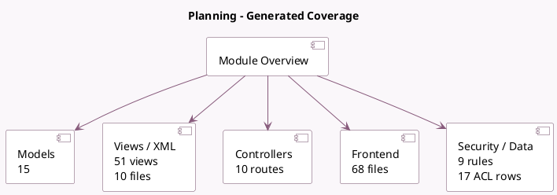

<!-- GENERATED:MODULE -->
---
tags: [odoo, enterprise, module]
---

# Planning

- Scope: Enterprise Addons
- Source: enterprise/planning
- Dependencies: [[docs/Community Addons/hr/hr|hr]], [[docs/Community Addons/hr_hourly_cost/hr_hourly_cost|hr_hourly_cost]], [[docs/Enterprise Addons/web_gantt/web_gantt|web_gantt]], [[docs/Community Addons/digest/digest|digest]]

## Summary

Manage your employees' schedule

## Generated coverage

- Models: 15
- XML files with UI/data artifacts: 10
- Views: 51
- Actions: 40
- Menus: 14
- Rules (ir.rule): 9
- Access CSV entries: 17
- Controller units: 1
- Frontend asset files: 68

## Module map

## Detail notes

- Models: [[docs/Enterprise Addons/planning/Models|Models]] (15)
- Views and XML: [[docs/Enterprise Addons/planning/Views|Views]] (10 files)
- Controllers: [[docs/Enterprise Addons/planning/Controllers|Controllers]] (1)
- Frontend: [[docs/Enterprise Addons/planning/Frontend|Frontend]] (68 files)

## Key models

- `hr.departure.wizard`
- `hr.employee`
- `hr.employee.public`
- `planning.analysis.report`
- `planning.calendar.resource`
- `planning.planning`
- `planning.preview`
- `planning.recurrency`
- `planning.role`
- `planning.send`
- `planning.slot`
- `planning.slot.template`

## Navigation

- [[../Enterprise Addons/Enterprise Addons|Back to scope]]
- [[../../docs/docs|Back to docs]]

<!-- GENERATED:MODULE -->

