<!-- GENERATED:MODEL -->
---
tags: [odoo, enterprise, generated, model]
---

# planning.attendance.analysis.report

- Module: [[docs/Enterprise Addons/planning_attendance/planning_attendance|planning_attendance]]
- Scope: Enterprise Addons
- Defined in module: yes
- Source files: `report/planning_attendance_analysis_report.py`
- Python classes: `PlanningAttendanceAnalysisReport`
- Description: Planning / Attendance Analysis

## Field footprint

- Detected fields: 10
- Field types: `Date` x 1, `Float` x 6, `Many2one` x 3
- Relation fields: 3

## Sample fields

- `company_id`: `Many2one` (comodel `res.company`)
- `cost_difference`: `Float` (comodel `Cost Difference`)
- `department_id`: `Many2one` (comodel `hr.department`)
- `effective_costs`: `Float` (comodel `Attendance Cost`)
- `effective_hours`: `Float` (comodel `Attendance Time`)
- `employee_id`: `Many2one` (comodel `hr.employee`)
- `entry_date`: `Date`
- `planned_costs`: `Float` (comodel `Planned Cost`)
- `planned_hours`: `Float` (comodel `Planned Time`)
- `time_difference`: `Float` (comodel `Time Difference`)

## Method hints

- Detected methods: 2
- Action methods: none
- Compute methods: none
- Onchange methods: none

## Direct relation diagram

```plantuml
@startuml
!define ODOO_COLOR_PRIMARY #714B67
!define ODOO_COLOR_ACCENT #875A7B
!define ODOO_COLOR_BG #FAF7FA

skinparam backgroundColor ODOO_COLOR_BG
skinparam defaultTextAlignment left
skinparam ArrowColor ODOO_COLOR_ACCENT
skinparam ClassBackgroundColor white
skinparam ClassBorderColor ODOO_COLOR_PRIMARY
skinparam ComponentBackgroundColor white
skinparam ComponentBorderColor ODOO_COLOR_PRIMARY
skinparam NoteBackgroundColor #FFF8FF
skinparam NoteBorderColor ODOO_COLOR_ACCENT
skinparam SequenceLifeLineBorderColor ODOO_COLOR_ACCENT
skinparam SequenceLifeLineBackgroundColor #FFFFFF
skinparam SequenceParticipantBorderColor ODOO_COLOR_PRIMARY
skinparam SequenceParticipantBackgroundColor #FFFFFF
skinparam sequence {
  ArrowColor ODOO_COLOR_ACCENT
  ActorBorderColor ODOO_COLOR_PRIMARY
}
title planning.attendance.analysis.report - Direct Relations
class "planning.attendance.analysis.report" as planning_attendance_analysis_report
class "hr.department" as hr_department
class "hr.employee" as hr_employee
class "res.company" as res_company
planning_attendance_analysis_report --> hr_employee : employee_id
planning_attendance_analysis_report --> hr_department : department_id
planning_attendance_analysis_report --> res_company : company_id
@enduml
```

## Navigation

- **Parent:** [[docs/Enterprise Addons/planning_attendance/Models]]

<!-- GENERATED:MODEL -->
