<!-- GENERATED:MODEL -->
---
tags: [odoo, enterprise, generated, model]
---

# planning.analysis.report

- Module: [[docs/Enterprise Addons/planning_hr_skills/planning_hr_skills|planning_hr_skills]]
- Scope: Enterprise Addons
- Defined in module: extension only
- Source files: `report/planning_analysis_report.py`
- Python classes: `PlanningAnalysisReport`

## Field footprint

- Detected fields: 1
- Field types: `One2many` x 1
- Relation fields: 1

## Sample fields

- `employee_skill_ids`: `One2many` (comodel `hr.employee.skill`, compute `_compute_employee_skill_ids`)

## Method hints

- Detected methods: 2
- Action methods: none
- Compute methods: `_compute_employee_skill_ids`
- Onchange methods: none

## Direct relation diagram

```plantuml
@startuml
!define ODOO_COLOR_PRIMARY #714B67
!define ODOO_COLOR_ACCENT #875A7B
!define ODOO_COLOR_BG #FAF7FA

skinparam backgroundColor ODOO_COLOR_BG
skinparam defaultTextAlignment left
skinparam ArrowColor ODOO_COLOR_ACCENT
skinparam ClassBackgroundColor white
skinparam ClassBorderColor ODOO_COLOR_PRIMARY
skinparam ComponentBackgroundColor white
skinparam ComponentBorderColor ODOO_COLOR_PRIMARY
skinparam NoteBackgroundColor #FFF8FF
skinparam NoteBorderColor ODOO_COLOR_ACCENT
skinparam SequenceLifeLineBorderColor ODOO_COLOR_ACCENT
skinparam SequenceLifeLineBackgroundColor #FFFFFF
skinparam SequenceParticipantBorderColor ODOO_COLOR_PRIMARY
skinparam SequenceParticipantBackgroundColor #FFFFFF
skinparam sequence {
  ArrowColor ODOO_COLOR_ACCENT
  ActorBorderColor ODOO_COLOR_PRIMARY
}
title planning.analysis.report - Direct Relations
class "planning.analysis.report" as planning_analysis_report
class "hr.employee.skill" as hr_employee_skill
planning_analysis_report --|> hr_employee_skill : employee_skill_ids
@enduml
```

## Navigation

- **Parent:** [[docs/Enterprise Addons/planning_hr_skills/Models]]

<!-- GENERATED:MODEL -->
