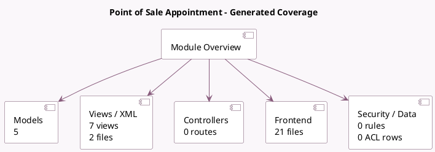

<!-- GENERATED:MODULE -->
---
tags: [odoo, enterprise, module]
---

# Point of Sale Appointment

- Scope: Enterprise Addons
- Source: enterprise/pos_appointment
- Dependencies: [[docs/Enterprise Addons/appointment/appointment|appointment]], [[docs/Community Addons/point_of_sale/point_of_sale|point_of_sale]]

## Summary

This module lets you manage online reservations for PoS

## Generated coverage

- Models: 5
- XML files with UI/data artifacts: 2
- Views: 7
- Actions: 0
- Menus: 0
- Rules (ir.rule): 0
- Access CSV entries: 0
- Controller units: 0
- Frontend asset files: 21

## Module map

## Detail notes

- Models: [[docs/Enterprise Addons/pos_appointment/Models|Models]] (5)
- Views and XML: [[docs/Enterprise Addons/pos_appointment/Views|Views]] (2 files)
- Frontend: [[docs/Enterprise Addons/pos_appointment/Frontend|Frontend]] (21 files)

## Key models

- `appointment.type`
- `calendar.event`
- `pos.config`
- `pos.session`
- `res.config.settings`

## Navigation

- [[../Enterprise Addons/Enterprise Addons|Back to scope]]
- [[../../docs/docs|Back to docs]]

<!-- GENERATED:MODULE -->

