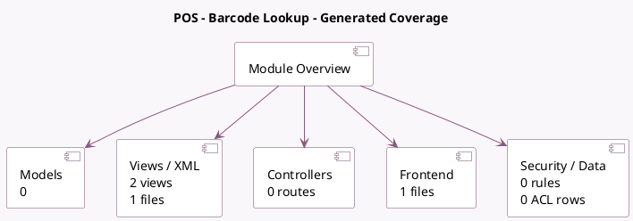

<!-- GENERATED:MODULE -->
---
tags: [odoo, enterprise, module]
---

# POS - Barcode Lookup

- Scope: Enterprise Addons
- Source: enterprise/pos_barcodelookup
- Dependencies: [[docs/Community Addons/point_of_sale/point_of_sale|point_of_sale]], [[docs/Enterprise Addons/product_barcodelookup/product_barcodelookup|product_barcodelookup]]

## Summary

This module enables product creation by scanning barcodes with a camera, utilizing the Barcode Lookup API Key.

## Generated coverage

- Models: 0
- XML files with UI/data artifacts: 1
- Views: 2
- Actions: 2
- Menus: 0
- Rules (ir.rule): 0
- Access CSV entries: 0
- Controller units: 0
- Frontend asset files: 1

## Module map

## Detail notes

- Views and XML: [[docs/Enterprise Addons/pos_barcodelookup/Views|Views]] (1 files)
- Frontend: [[docs/Enterprise Addons/pos_barcodelookup/Frontend|Frontend]] (1 files)

## Navigation

- [[../Enterprise Addons/Enterprise Addons|Back to scope]]
- [[../../docs/docs|Back to docs]]

<!-- GENERATED:MODULE -->

