<!-- GENERATED:MODEL -->
---
tags: [odoo, enterprise, generated, model]
---

# pos.config

- Module: [[docs/Enterprise Addons/pos_blackbox_be/pos_blackbox_be|pos_blackbox_be]]
- Scope: Enterprise Addons
- Defined in module: extension only
- Source files: `models/pos_config.py`
- Python classes: `PosConfig`

## Field footprint

- Detected fields: 3
- Field types: `Char` x 2, `Many2one` x 1
- Relation fields: 1

## Sample fields

- `certified_blackbox_identifier`: `Char` (comodel `Blackbox Identifier`, compute `_compute_certified_pos`, store `True`)
- `iface_fiscal_data_module`: `Many2one` (comodel `iot.device`)
- `pos_version`: `Char` (comodel `Odoo Version`, compute `_compute_odoo_version`)

## Method hints

- Detected methods: 24
- Action methods: `action_close_kiosk_session`
- Compute methods: `_compute_certified_pos`, `_compute_iot_device_ids`, `_compute_odoo_version`
- Onchange methods: none

## Direct relation diagram

```plantuml
@startuml
!define ODOO_COLOR_PRIMARY #714B67
!define ODOO_COLOR_ACCENT #875A7B
!define ODOO_COLOR_BG #FAF7FA

skinparam backgroundColor ODOO_COLOR_BG
skinparam defaultTextAlignment left
skinparam ArrowColor ODOO_COLOR_ACCENT
skinparam ClassBackgroundColor white
skinparam ClassBorderColor ODOO_COLOR_PRIMARY
skinparam ComponentBackgroundColor white
skinparam ComponentBorderColor ODOO_COLOR_PRIMARY
skinparam NoteBackgroundColor #FFF8FF
skinparam NoteBorderColor ODOO_COLOR_ACCENT
skinparam SequenceLifeLineBorderColor ODOO_COLOR_ACCENT
skinparam SequenceLifeLineBackgroundColor #FFFFFF
skinparam SequenceParticipantBorderColor ODOO_COLOR_PRIMARY
skinparam SequenceParticipantBackgroundColor #FFFFFF
skinparam sequence {
  ArrowColor ODOO_COLOR_ACCENT
  ActorBorderColor ODOO_COLOR_PRIMARY
}
title pos.config - Direct Relations
class "pos.config" as pos_config
class "iot.device" as iot_device
pos_config --> iot_device : iface_fiscal_data_module
@enduml
```

## Navigation

- **Parent:** [[docs/Enterprise Addons/pos_blackbox_be/Models]]

<!-- GENERATED:MODEL -->
