<!-- GENERATED:MODEL -->
---
tags: [odoo, enterprise, generated, model]
---

# pos.session

- Module: [[docs/Enterprise Addons/pos_blackbox_be/pos_blackbox_be|pos_blackbox_be]]
- Scope: Enterprise Addons
- Defined in module: extension only
- Source files: `models/pos_session.py`
- Python classes: `PosSession`

## Field footprint

- Detected fields: 9
- Field types: `Integer` x 4, `Many2many` x 2, `Monetary` x 3
- Relation fields: 2

## Sample fields

- `cash_box_opening_number`: `Integer`
- `correction_amount`: `Monetary`
- `correction_number`: `Integer`
- `employees_clocked_ids`: `Many2many` (comodel `hr.employee`)
- `pro_forma_refund_amount`: `Monetary`
- `pro_forma_refund_number`: `Integer`
- `pro_forma_sales_amount`: `Monetary`
- `pro_forma_sales_number`: `Integer`
- `users_clocked_ids`: `Many2many` (comodel `res.users`)

## Method hints

- Detected methods: 13
- Action methods: `action_report_journal_file`
- Compute methods: `_compute_amount_of_vat_tickets`
- Onchange methods: none

## Direct relation diagram

```plantuml
@startuml
!define ODOO_COLOR_PRIMARY #714B67
!define ODOO_COLOR_ACCENT #875A7B
!define ODOO_COLOR_BG #FAF7FA

skinparam backgroundColor ODOO_COLOR_BG
skinparam defaultTextAlignment left
skinparam ArrowColor ODOO_COLOR_ACCENT
skinparam ClassBackgroundColor white
skinparam ClassBorderColor ODOO_COLOR_PRIMARY
skinparam ComponentBackgroundColor white
skinparam ComponentBorderColor ODOO_COLOR_PRIMARY
skinparam NoteBackgroundColor #FFF8FF
skinparam NoteBorderColor ODOO_COLOR_ACCENT
skinparam SequenceLifeLineBorderColor ODOO_COLOR_ACCENT
skinparam SequenceLifeLineBackgroundColor #FFFFFF
skinparam SequenceParticipantBorderColor ODOO_COLOR_PRIMARY
skinparam SequenceParticipantBackgroundColor #FFFFFF
skinparam sequence {
  ArrowColor ODOO_COLOR_ACCENT
  ActorBorderColor ODOO_COLOR_PRIMARY
}
title pos.session - Direct Relations
class "pos.session" as pos_session
class "hr.employee" as hr_employee
class "res.users" as res_users
pos_session .. res_users : users_clocked_ids
pos_session .. hr_employee : employees_clocked_ids
@enduml
```

## Navigation

- **Parent:** [[docs/Enterprise Addons/pos_blackbox_be/Models]]

<!-- GENERATED:MODEL -->
