<!-- GENERATED:MODEL -->
---
tags: [odoo, enterprise, generated, model]
---

# pos_blackbox_be.log

- Module: [[docs/Enterprise Addons/pos_blackbox_be/pos_blackbox_be|pos_blackbox_be]]
- Scope: Enterprise Addons
- Defined in module: yes
- Source files: `models/pos_blackbox_log.py`
- Python classes: `PosBlackboxBeLog`
- Description: Track every changes made while using the Blackbox

## Field footprint

- Detected fields: 6
- Field types: `Char` x 3, `Datetime` x 1, `Many2one` x 1, `Selection` x 1
- Relation fields: 1

## Sample fields

- `action`: `Selection`
- `date`: `Datetime`
- `description`: `Char`
- `model_name`: `Char`
- `record_name`: `Char`
- `user`: `Many2one` (comodel `res.users`)

## Method hints

- Detected methods: 1
- Action methods: none
- Compute methods: none
- Onchange methods: none

## Direct relation diagram

```plantuml
@startuml
!define ODOO_COLOR_PRIMARY #714B67
!define ODOO_COLOR_ACCENT #875A7B
!define ODOO_COLOR_BG #FAF7FA

skinparam backgroundColor ODOO_COLOR_BG
skinparam defaultTextAlignment left
skinparam ArrowColor ODOO_COLOR_ACCENT
skinparam ClassBackgroundColor white
skinparam ClassBorderColor ODOO_COLOR_PRIMARY
skinparam ComponentBackgroundColor white
skinparam ComponentBorderColor ODOO_COLOR_PRIMARY
skinparam NoteBackgroundColor #FFF8FF
skinparam NoteBorderColor ODOO_COLOR_ACCENT
skinparam SequenceLifeLineBorderColor ODOO_COLOR_ACCENT
skinparam SequenceLifeLineBackgroundColor #FFFFFF
skinparam SequenceParticipantBorderColor ODOO_COLOR_PRIMARY
skinparam SequenceParticipantBackgroundColor #FFFFFF
skinparam sequence {
  ArrowColor ODOO_COLOR_ACCENT
  ActorBorderColor ODOO_COLOR_PRIMARY
}
title pos_blackbox_be.log - Direct Relations
class "pos_blackbox_be.log" as pos_blackbox_be_log
class "res.users" as res_users
pos_blackbox_be_log --> res_users : user
@enduml
```

## Navigation

- **Parent:** [[docs/Enterprise Addons/pos_blackbox_be/Models]]

<!-- GENERATED:MODEL -->
