<!-- GENERATED:MODEL -->
---
tags: [odoo, enterprise, generated, model]
---

# res.users

- Module: [[docs/Enterprise Addons/pos_blackbox_be/pos_blackbox_be|pos_blackbox_be]]
- Scope: Enterprise Addons
- Defined in module: extension only
- Source files: `models/res_users.py`
- Python classes: `ResUsers`

## Field footprint

- Detected fields: 2
- Field types: `Char` x 1, `Many2many` x 1
- Relation fields: 1

## Sample fields

- `insz_or_bis_number`: `Char` (comodel `National Register Number`)
- `session_clocked_ids`: `Many2many` (comodel `pos.session`)

## Method hints

- Detected methods: 5
- Action methods: none
- Compute methods: none
- Onchange methods: none

## Direct relation diagram

```plantuml
@startuml
!define ODOO_COLOR_PRIMARY #714B67
!define ODOO_COLOR_ACCENT #875A7B
!define ODOO_COLOR_BG #FAF7FA

skinparam backgroundColor ODOO_COLOR_BG
skinparam defaultTextAlignment left
skinparam ArrowColor ODOO_COLOR_ACCENT
skinparam ClassBackgroundColor white
skinparam ClassBorderColor ODOO_COLOR_PRIMARY
skinparam ComponentBackgroundColor white
skinparam ComponentBorderColor ODOO_COLOR_PRIMARY
skinparam NoteBackgroundColor #FFF8FF
skinparam NoteBorderColor ODOO_COLOR_ACCENT
skinparam SequenceLifeLineBorderColor ODOO_COLOR_ACCENT
skinparam SequenceLifeLineBackgroundColor #FFFFFF
skinparam SequenceParticipantBorderColor ODOO_COLOR_PRIMARY
skinparam SequenceParticipantBackgroundColor #FFFFFF
skinparam sequence {
  ArrowColor ODOO_COLOR_ACCENT
  ActorBorderColor ODOO_COLOR_PRIMARY
}
title res.users - Direct Relations
class "res.users" as res_users
class "pos.session" as pos_session
res_users .. pos_session : session_clocked_ids
@enduml
```

## Navigation

- **Parent:** [[docs/Enterprise Addons/pos_blackbox_be/Models]]

<!-- GENERATED:MODEL -->
