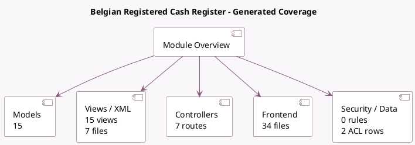

<!-- GENERATED:MODULE -->
---
tags: [odoo, enterprise, module]
---

# Belgian Registered Cash Register

- Scope: Enterprise Addons
- Source: enterprise/pos_blackbox_be
- Dependencies: [[docs/Enterprise Addons/pos_iot/pos_iot|pos_iot]], [[docs/Community Addons/l10n_be/l10n_be|l10n_be]], [[docs/Enterprise Addons/web_enterprise/web_enterprise|web_enterprise]], [[docs/Community Addons/pos_hr/pos_hr|pos_hr]], [[docs/Community Addons/pos_restaurant/pos_restaurant|pos_restaurant]], [[docs/Community Addons/pos_discount/pos_discount|pos_discount]], [[docs/Community Addons/pos_self_order/pos_self_order|pos_self_order]], [[docs/Enterprise Addons/pos_urban_piper/pos_urban_piper|pos_urban_piper]]

## Summary

Implements the registered cash system, adhering to guidelines by FPS Finance.

## Generated coverage

- Models: 15
- XML files with UI/data artifacts: 7
- Views: 15
- Actions: 2
- Menus: 1
- Rules (ir.rule): 0
- Access CSV entries: 2
- Controller units: 3
- Frontend asset files: 34

## Module map

## Detail notes

- Models: [[docs/Enterprise Addons/pos_blackbox_be/Models|Models]] (15)
- Views and XML: [[docs/Enterprise Addons/pos_blackbox_be/Views|Views]] (7 files)
- Controllers: [[docs/Enterprise Addons/pos_blackbox_be/Controllers|Controllers]] (3)
- Frontend: [[docs/Enterprise Addons/pos_blackbox_be/Frontend|Frontend]] (34 files)

## Key models

- `account.tax`
- `hr.employee`
- `ir.module.module`
- `pos.blackbox.log.ip`
- `pos.category`
- `pos.config`
- `pos.make.payment`
- `pos.order`
- `pos.order.line`
- `pos.session`
- `pos_blackbox_be.log`
- `product.template`

## Navigation

- [[../Enterprise Addons/Enterprise Addons|Back to scope]]
- [[../../docs/docs|Back to docs]]

<!-- GENERATED:MODULE -->

