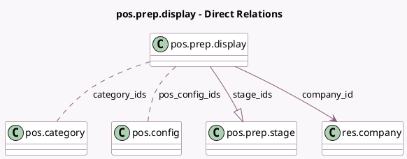

<!-- GENERATED:MODEL -->
---
tags: [odoo, enterprise, generated, model]
---

# pos.prep.display

- Module: [[docs/Enterprise Addons/pos_enterprise/pos_enterprise|pos_enterprise]]
- Scope: Enterprise Addons
- Defined in module: yes
- Source files: `models/pos_prep_display.py`
- Python classes: `PosPrepDisplay`
- Description: Pos Preparation Display
- Inherits: `pos.bus.mixin`, `pos.load.mixin`

## Field footprint

- Detected fields: 11
- Field types: `Boolean` x 2, `Char` x 2, `Integer` x 3, `Many2many` x 2, `Many2one` x 1, `One2many` x 1
- Relation fields: 4

## Sample fields

- `access_token`: `Char` (comodel `Access Token`)
- `auto_clear`: `Boolean`
- `average_time`: `Integer` (comodel `Order average time`, compute `_compute_order_count`)
- `category_ids`: `Many2many` (comodel `pos.category`)
- `clear_time_interval`: `Integer`
- `company_id`: `Many2one` (comodel `res.company`)
- `contains_bar_restaurant`: `Boolean` (comodel `Is a Bar/Restaurant`, compute `_compute_contains_bar_restaurant`, store `True`)
- `name`: `Char` (comodel `Name`)
- `order_count`: `Integer` (comodel `Order count`, compute `_compute_order_count`)
- `pos_config_ids`: `Many2many` (comodel `pos.config`)
- `stage_ids`: `One2many` (comodel `pos.prep.stage`)

## Method hints

- Detected methods: 20
- Action methods: none
- Compute methods: `_compute_contains_bar_restaurant`, `_compute_order_count`
- Onchange methods: none

## Direct relation diagram

## Navigation

- **Parent:** [[docs/Enterprise Addons/pos_enterprise/Models]]

<!-- GENERATED:MODEL -->
