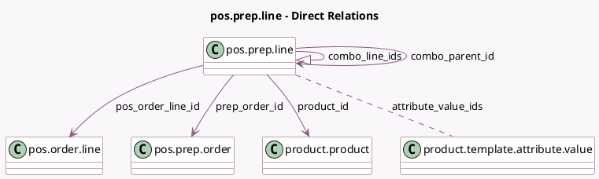

<!-- GENERATED:MODEL -->
---
tags: [odoo, enterprise, generated, model]
---

# pos.prep.line

- Module: [[docs/Enterprise Addons/pos_enterprise/pos_enterprise|pos_enterprise]]
- Scope: Enterprise Addons
- Defined in module: yes
- Source files: `models/pos_prep_line.py`
- Python classes: `PosPrepLine`
- Description: Pos Preparation Line
- Inherits: `pos.load.mixin`

## Field footprint

- Detected fields: 11
- Field types: `Char` x 3, `Float` x 2, `Many2many` x 1, `Many2one` x 4, `One2many` x 1
- Relation fields: 6

## Sample fields

- `attribute_value_ids`: `Many2many` (comodel `product.template.attribute.value`)
- `cancelled`: `Float` (comodel `Quantity of cancelled product`)
- `combo_line_ids`: `One2many` (comodel `pos.prep.line`)
- `combo_parent_id`: `Many2one` (comodel `pos.prep.line`)
- `customer_note`: `Char`
- `internal_note`: `Char`
- `pos_order_line_id`: `Many2one` (comodel `pos.order.line`)
- `pos_order_line_uuid`: `Char`
- `prep_order_id`: `Many2one` (comodel `pos.prep.order`)
- `product_id`: `Many2one` (comodel `product.product`)
- `quantity`: `Float` (comodel `Quantity`)

## Method hints

- Detected methods: 0
- Action methods: none
- Compute methods: none
- Onchange methods: none

## Direct relation diagram

## Navigation

- **Parent:** [[docs/Enterprise Addons/pos_enterprise/Models]]

<!-- GENERATED:MODEL -->
