<!-- GENERATED:MODEL -->
---
tags: [odoo, enterprise, generated, model]
---

# pos.prep.order

- Module: [[docs/Enterprise Addons/pos_enterprise/pos_enterprise|pos_enterprise]]
- Scope: Enterprise Addons
- Defined in module: yes
- Source files: `models/pos_prep_order.py`
- Python classes: `PosPrepOrder`
- Description: Pos Preparation Order
- Inherits: `pos.load.mixin`

## Field footprint

- Detected fields: 6
- Field types: `Char` x 1, `Integer` x 1, `Many2one` x 1, `One2many` x 1, `Text` x 2
- Relation fields: 2

## Sample fields

- `completion_time`: `Integer` (comodel `Completion Time`)
- `order_name`: `Char` (compute `_compute_order_name`)
- `pdis_general_customer_note`: `Text` (comodel `General Customer Note`)
- `pdis_internal_note`: `Text` (comodel `General Note`)
- `pos_order_id`: `Many2one` (comodel `pos.order`)
- `prep_line_ids`: `One2many` (comodel `pos.prep.line`)

## Method hints

- Detected methods: 3
- Action methods: none
- Compute methods: `_compute_order_name`
- Onchange methods: none

## Direct relation diagram

```plantuml
@startuml
!define ODOO_COLOR_PRIMARY #714B67
!define ODOO_COLOR_ACCENT #875A7B
!define ODOO_COLOR_BG #FAF7FA

skinparam backgroundColor ODOO_COLOR_BG
skinparam defaultTextAlignment left
skinparam ArrowColor ODOO_COLOR_ACCENT
skinparam ClassBackgroundColor white
skinparam ClassBorderColor ODOO_COLOR_PRIMARY
skinparam ComponentBackgroundColor white
skinparam ComponentBorderColor ODOO_COLOR_PRIMARY
skinparam NoteBackgroundColor #FFF8FF
skinparam NoteBorderColor ODOO_COLOR_ACCENT
skinparam SequenceLifeLineBorderColor ODOO_COLOR_ACCENT
skinparam SequenceLifeLineBackgroundColor #FFFFFF
skinparam SequenceParticipantBorderColor ODOO_COLOR_PRIMARY
skinparam SequenceParticipantBackgroundColor #FFFFFF
skinparam sequence {
  ArrowColor ODOO_COLOR_ACCENT
  ActorBorderColor ODOO_COLOR_PRIMARY
}
title pos.prep.order - Direct Relations
class "pos.prep.order" as pos_prep_order
class "pos.order" as pos_order
class "pos.prep.line" as pos_prep_line
pos_prep_order --> pos_order : pos_order_id
pos_prep_order --|> pos_prep_line : prep_line_ids
@enduml
```

## Navigation

- **Parent:** [[docs/Enterprise Addons/pos_enterprise/Models]]

<!-- GENERATED:MODEL -->
