<!-- GENERATED:MODEL -->
---
tags: [odoo, enterprise, generated, model]
---

# pos.prep.state

- Module: [[docs/Enterprise Addons/pos_enterprise/pos_enterprise|pos_enterprise]]
- Scope: Enterprise Addons
- Defined in module: yes
- Source files: `models/pos_prep_state.py`
- Python classes: `PosPreparationState`
- Description: Pos Preparation State
- Inherits: `pos.load.mixin`

## Field footprint

- Detected fields: 4
- Field types: `Boolean` x 1, `Datetime` x 1, `Many2one` x 2
- Relation fields: 2

## Sample fields

- `last_stage_change`: `Datetime`
- `prep_line_id`: `Many2one` (comodel `pos.prep.line`)
- `stage_id`: `Many2one` (comodel `pos.prep.stage`)
- `todo`: `Boolean` (comodel `Status of the orderline`)

## Method hints

- Detected methods: 4
- Action methods: none
- Compute methods: none
- Onchange methods: none

## Direct relation diagram

```plantuml
@startuml
!define ODOO_COLOR_PRIMARY #714B67
!define ODOO_COLOR_ACCENT #875A7B
!define ODOO_COLOR_BG #FAF7FA

skinparam backgroundColor ODOO_COLOR_BG
skinparam defaultTextAlignment left
skinparam ArrowColor ODOO_COLOR_ACCENT
skinparam ClassBackgroundColor white
skinparam ClassBorderColor ODOO_COLOR_PRIMARY
skinparam ComponentBackgroundColor white
skinparam ComponentBorderColor ODOO_COLOR_PRIMARY
skinparam NoteBackgroundColor #FFF8FF
skinparam NoteBorderColor ODOO_COLOR_ACCENT
skinparam SequenceLifeLineBorderColor ODOO_COLOR_ACCENT
skinparam SequenceLifeLineBackgroundColor #FFFFFF
skinparam SequenceParticipantBorderColor ODOO_COLOR_PRIMARY
skinparam SequenceParticipantBackgroundColor #FFFFFF
skinparam sequence {
  ArrowColor ODOO_COLOR_ACCENT
  ActorBorderColor ODOO_COLOR_PRIMARY
}
title pos.prep.state - Direct Relations
class "pos.prep.state" as pos_prep_state
class "pos.prep.line" as pos_prep_line
class "pos.prep.stage" as pos_prep_stage
pos_prep_state --> pos_prep_line : prep_line_id
pos_prep_state --> pos_prep_stage : stage_id
@enduml
```

## Navigation

- **Parent:** [[docs/Enterprise Addons/pos_enterprise/Models]]

<!-- GENERATED:MODEL -->
