<!-- GENERATED:MODEL -->
---
tags: [odoo, enterprise, generated, model]
---

# preparation.time.report

- Module: [[docs/Enterprise Addons/pos_enterprise/pos_enterprise|pos_enterprise]]
- Scope: Enterprise Addons
- Defined in module: yes
- Source files: `report/preparation_time_report.py`
- Python classes: `PreparationTimeReport`
- Description: POS Preparation Time Report

## Field footprint

- Detected fields: 8
- Field types: `Char` x 1, `Datetime` x 1, `Float` x 3, `Many2one` x 3
- Relation fields: 3

## Sample fields

- `avg_preparation_time`: `Float` (comodel `Average Preparation Time`)
- `create_date`: `Datetime` (comodel `Order Date`)
- `order_hour`: `Char` (comodel `Hour`)
- `order_id`: `Many2one` (comodel `pos.order`)
- `pos_config_id`: `Many2one` (comodel `pos.config`)
- `preparation_time`: `Float` (comodel `Preparation Time`)
- `product_id`: `Many2one` (comodel `product.product`)
- `qty`: `Float` (comodel `Quantity`)

## Method hints

- Detected methods: 2
- Action methods: none
- Compute methods: none
- Onchange methods: none

## Direct relation diagram

```plantuml
@startuml
!define ODOO_COLOR_PRIMARY #714B67
!define ODOO_COLOR_ACCENT #875A7B
!define ODOO_COLOR_BG #FAF7FA

skinparam backgroundColor ODOO_COLOR_BG
skinparam defaultTextAlignment left
skinparam ArrowColor ODOO_COLOR_ACCENT
skinparam ClassBackgroundColor white
skinparam ClassBorderColor ODOO_COLOR_PRIMARY
skinparam ComponentBackgroundColor white
skinparam ComponentBorderColor ODOO_COLOR_PRIMARY
skinparam NoteBackgroundColor #FFF8FF
skinparam NoteBorderColor ODOO_COLOR_ACCENT
skinparam SequenceLifeLineBorderColor ODOO_COLOR_ACCENT
skinparam SequenceLifeLineBackgroundColor #FFFFFF
skinparam SequenceParticipantBorderColor ODOO_COLOR_PRIMARY
skinparam SequenceParticipantBackgroundColor #FFFFFF
skinparam sequence {
  ArrowColor ODOO_COLOR_ACCENT
  ActorBorderColor ODOO_COLOR_PRIMARY
}
title preparation.time.report - Direct Relations
class "preparation.time.report" as preparation_time_report
class "pos.config" as pos_config
class "pos.order" as pos_order
class "product.product" as product_product
preparation_time_report --> pos_config : pos_config_id
preparation_time_report --> product_product : product_id
preparation_time_report --> pos_order : order_id
@enduml
```

## Navigation

- **Parent:** [[docs/Enterprise Addons/pos_enterprise/Models]]

<!-- GENERATED:MODEL -->
