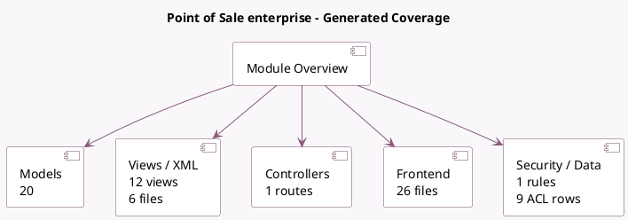

<!-- GENERATED:MODULE -->
---
tags: [odoo, enterprise, module]
---

# Point of Sale enterprise

- Scope: Enterprise Addons
- Source: enterprise/pos_enterprise
- Dependencies: [[docs/Enterprise Addons/web_enterprise/web_enterprise|web_enterprise]], [[docs/Community Addons/point_of_sale/point_of_sale|point_of_sale]]

## Summary

Advanced features for PoS

## Generated coverage

- Models: 20
- XML files with UI/data artifacts: 6
- Views: 12
- Actions: 5
- Menus: 3
- Rules (ir.rule): 1
- Access CSV entries: 9
- Controller units: 1
- Frontend asset files: 26

## Module map

## Detail notes

- Models: [[docs/Enterprise Addons/pos_enterprise/Models|Models]] (20)
- Views and XML: [[docs/Enterprise Addons/pos_enterprise/Views|Views]] (6 files)
- Controllers: [[docs/Enterprise Addons/pos_enterprise/Controllers|Controllers]] (1)
- Frontend: [[docs/Enterprise Addons/pos_enterprise/Frontend|Frontend]] (26 files)

## Key models

- `pos.category`
- `pos.config`
- `pos.load.mixin`
- `pos.order`
- `pos.order.line`
- `pos.prep.display`
- `pos.prep.line`
- `pos.prep.order`
- `pos.prep.stage`
- `pos.prep.state`
- `pos.preparation.display.reset.wizard`
- `pos.preset`

## Navigation

- [[../Enterprise Addons/Enterprise Addons|Back to scope]]
- [[../../docs/docs|Back to docs]]

<!-- GENERATED:MODULE -->

