<!-- GENERATED:MODEL -->
---
tags: [odoo, enterprise, generated, model]
---

# auto.config.pos.iot

- Module: [[docs/Enterprise Addons/pos_iot/pos_iot|pos_iot]]
- Scope: Enterprise Addons
- Defined in module: yes
- Source files: `wizard/auto_config_pos_iot.py`
- Python classes: `AutoConfigPoSIoT`
- Description: Configure Automatically IoT Box In PoS

## Field footprint

- Detected fields: 3
- Field types: `Char` x 1, `Many2many` x 1, `Many2one` x 1
- Relation fields: 2

## Sample fields

- `iot_box_id`: `Many2one` (comodel `iot.box`, compute `_compute_iot_box_id`)
- `iot_box_identifier`: `Char`
- `pos_config_ids`: `Many2many` (comodel `pos.config`)

## Method hints

- Detected methods: 3
- Action methods: `action_autoconfigure`
- Compute methods: `_compute_iot_box_id`
- Onchange methods: none

## Direct relation diagram

```plantuml
@startuml
!define ODOO_COLOR_PRIMARY #714B67
!define ODOO_COLOR_ACCENT #875A7B
!define ODOO_COLOR_BG #FAF7FA

skinparam backgroundColor ODOO_COLOR_BG
skinparam defaultTextAlignment left
skinparam ArrowColor ODOO_COLOR_ACCENT
skinparam ClassBackgroundColor white
skinparam ClassBorderColor ODOO_COLOR_PRIMARY
skinparam ComponentBackgroundColor white
skinparam ComponentBorderColor ODOO_COLOR_PRIMARY
skinparam NoteBackgroundColor #FFF8FF
skinparam NoteBorderColor ODOO_COLOR_ACCENT
skinparam SequenceLifeLineBorderColor ODOO_COLOR_ACCENT
skinparam SequenceLifeLineBackgroundColor #FFFFFF
skinparam SequenceParticipantBorderColor ODOO_COLOR_PRIMARY
skinparam SequenceParticipantBackgroundColor #FFFFFF
skinparam sequence {
  ArrowColor ODOO_COLOR_ACCENT
  ActorBorderColor ODOO_COLOR_PRIMARY
}
title auto.config.pos.iot - Direct Relations
class "auto.config.pos.iot" as auto_config_pos_iot
class "iot.box" as iot_box
class "pos.config" as pos_config
auto_config_pos_iot .. pos_config : pos_config_ids
auto_config_pos_iot --> iot_box : iot_box_id
@enduml
```

## Navigation

- **Parent:** [[docs/Enterprise Addons/pos_iot/Models]]

<!-- GENERATED:MODEL -->
