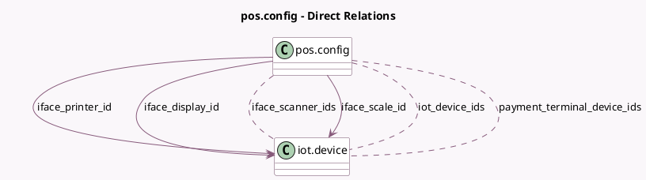

<!-- GENERATED:MODEL -->
---
tags: [odoo, enterprise, generated, model]
---

# pos.config

- Module: [[docs/Enterprise Addons/pos_iot/pos_iot|pos_iot]]
- Scope: Enterprise Addons
- Defined in module: extension only
- Source files: `models/pos_config.py`
- Python classes: `PosConfig`

## Field footprint

- Detected fields: 9
- Field types: `Boolean` x 3, `Many2many` x 3, `Many2one` x 3
- Relation fields: 6

## Sample fields

- `iface_display_id`: `Many2one` (comodel `iot.device`)
- `iface_electronic_scale`: `Boolean` (compute `_compute_electronic_scale`)
- `iface_print_via_proxy`: `Boolean` (compute `_compute_print_via_proxy`)
- `iface_printer_id`: `Many2one` (comodel `iot.device`)
- `iface_scale_id`: `Many2one` (comodel `iot.device`)
- `iface_scan_via_proxy`: `Boolean` (compute `_compute_scan_via_proxy`)
- `iface_scanner_ids`: `Many2many` (comodel `iot.device`)
- `iot_device_ids`: `Many2many` (comodel `iot.device`, compute `_compute_iot_device_ids`)
- `payment_terminal_device_ids`: `Many2many` (comodel `iot.device`, compute `_compute_payment_terminal_device_ids`)

## Method hints

- Detected methods: 7
- Action methods: none
- Compute methods: `_compute_electronic_scale`, `_compute_iot_device_ids`, `_compute_payment_terminal_device_ids`, `_compute_print_via_proxy`, `_compute_scan_via_proxy`
- Onchange methods: none

## Direct relation diagram

## Navigation

- **Parent:** [[docs/Enterprise Addons/pos_iot/Models]]

<!-- GENERATED:MODEL -->
