<!-- GENERATED:MODEL -->
---
tags: [odoo, enterprise, generated, model]
---

# pos.printer

- Module: [[docs/Enterprise Addons/pos_iot/pos_iot|pos_iot]]
- Scope: Enterprise Addons
- Defined in module: extension only
- Source files: `models/pos_printer.py`
- Python classes: `PosPrinter`

## Field footprint

- Detected fields: 3
- Field types: `Char` x 2, `Many2one` x 1
- Relation fields: 1

## Sample fields

- `device_id`: `Many2one` (comodel `iot.device`)
- `device_identifier`: `Char` (related `device_id.identifier`)
- `proxy_ip`: `Char` (related `device_id.iot_ip`, store `True`)

## Method hints

- Detected methods: 2
- Action methods: none
- Compute methods: none
- Onchange methods: none

## Direct relation diagram

```plantuml
@startuml
!define ODOO_COLOR_PRIMARY #714B67
!define ODOO_COLOR_ACCENT #875A7B
!define ODOO_COLOR_BG #FAF7FA

skinparam backgroundColor ODOO_COLOR_BG
skinparam defaultTextAlignment left
skinparam ArrowColor ODOO_COLOR_ACCENT
skinparam ClassBackgroundColor white
skinparam ClassBorderColor ODOO_COLOR_PRIMARY
skinparam ComponentBackgroundColor white
skinparam ComponentBorderColor ODOO_COLOR_PRIMARY
skinparam NoteBackgroundColor #FFF8FF
skinparam NoteBorderColor ODOO_COLOR_ACCENT
skinparam SequenceLifeLineBorderColor ODOO_COLOR_ACCENT
skinparam SequenceLifeLineBackgroundColor #FFFFFF
skinparam SequenceParticipantBorderColor ODOO_COLOR_PRIMARY
skinparam SequenceParticipantBackgroundColor #FFFFFF
skinparam sequence {
  ArrowColor ODOO_COLOR_ACCENT
  ActorBorderColor ODOO_COLOR_PRIMARY
}
title pos.printer - Direct Relations
class "pos.printer" as pos_printer
class "iot.device" as iot_device
pos_printer --> iot_device : device_id
@enduml
```

## Navigation

- **Parent:** [[docs/Enterprise Addons/pos_iot/Models]]

<!-- GENERATED:MODEL -->
