<!-- GENERATED:MODEL -->
---
tags: [odoo, enterprise, generated, model]
---

# res.config.settings

- Module: [[docs/Enterprise Addons/pos_iot/pos_iot|pos_iot]]
- Scope: Enterprise Addons
- Defined in module: extension only
- Source files: `models/res_config_settings.py`
- Python classes: `ResConfigSettings`

## Field footprint

- Detected fields: 7
- Field types: `Boolean` x 3, `Many2many` x 1, `Many2one` x 3
- Relation fields: 4

## Sample fields

- `module_pos_iot_ingenico`: `Boolean` (comodel `Ingenico Payment Terminal`)
- `module_pos_iot_six`: `Boolean` (comodel `Six Payment Terminal`)
- `module_pos_iot_worldline`: `Boolean` (comodel `Worldline Payment Terminal`)
- `pos_iface_display_id`: `Many2one` (related `pos_config_id.iface_display_id`)
- `pos_iface_printer_id`: `Many2one` (related `pos_config_id.iface_printer_id`)
- `pos_iface_scale_id`: `Many2one` (related `pos_config_id.iface_scale_id`)
- `pos_iface_scanner_ids`: `Many2many` (related `pos_config_id.iface_scanner_ids`)

## Method hints

- Detected methods: 0
- Action methods: none
- Compute methods: none
- Onchange methods: none

## Direct relation diagram

```plantuml
@startuml
!define ODOO_COLOR_PRIMARY #714B67
!define ODOO_COLOR_ACCENT #875A7B
!define ODOO_COLOR_BG #FAF7FA

skinparam backgroundColor ODOO_COLOR_BG
skinparam defaultTextAlignment left
skinparam ArrowColor ODOO_COLOR_ACCENT
skinparam ClassBackgroundColor white
skinparam ClassBorderColor ODOO_COLOR_PRIMARY
skinparam ComponentBackgroundColor white
skinparam ComponentBorderColor ODOO_COLOR_PRIMARY
skinparam NoteBackgroundColor #FFF8FF
skinparam NoteBorderColor ODOO_COLOR_ACCENT
skinparam SequenceLifeLineBorderColor ODOO_COLOR_ACCENT
skinparam SequenceLifeLineBackgroundColor #FFFFFF
skinparam SequenceParticipantBorderColor ODOO_COLOR_PRIMARY
skinparam SequenceParticipantBackgroundColor #FFFFFF
skinparam sequence {
  ArrowColor ODOO_COLOR_ACCENT
  ActorBorderColor ODOO_COLOR_PRIMARY
}
title res.config.settings - Direct Relations
class "res.config.settings" as res_config_settings
@enduml
```

## Navigation

- **Parent:** [[docs/Enterprise Addons/pos_iot/Models]]

<!-- GENERATED:MODEL -->
