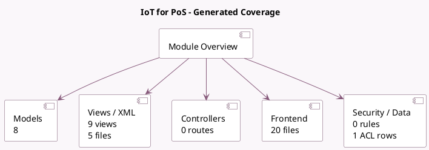

<!-- GENERATED:MODULE -->
---
tags: [odoo, enterprise, module]
---

# IoT for PoS

- Scope: Enterprise Addons
- Source: enterprise/pos_iot
- Dependencies: [[docs/Community Addons/point_of_sale/point_of_sale|point_of_sale]], [[docs/Enterprise Addons/iot/iot|iot]]

## Summary

Use IoT Devices in the PoS

## Generated coverage

- Models: 8
- XML files with UI/data artifacts: 5
- Views: 9
- Actions: 0
- Menus: 0
- Rules (ir.rule): 0
- Access CSV entries: 1
- Controller units: 0
- Frontend asset files: 20

## Module map

## Detail notes

- Models: [[docs/Enterprise Addons/pos_iot/Models|Models]] (8)
- Views and XML: [[docs/Enterprise Addons/pos_iot/Views|Views]] (5 files)
- Frontend: [[docs/Enterprise Addons/pos_iot/Frontend|Frontend]] (20 files)

## Key models

- `auto.config.pos.iot`
- `iot.box`
- `iot.device`
- `pos.config`
- `pos.payment.method`
- `pos.printer`
- `pos.session`
- `res.config.settings`

## Navigation

- [[../Enterprise Addons/Enterprise Addons|Back to scope]]
- [[../../docs/docs|Back to docs]]

<!-- GENERATED:MODULE -->

