<!-- GENERATED:MODEL -->
---
tags: [odoo, enterprise, generated, model]
---

# pos_iot_six.add_six_terminal

- Module: [[docs/Enterprise Addons/pos_iot_six/pos_iot_six|pos_iot_six]]
- Scope: Enterprise Addons
- Defined in module: yes
- Source files: `wizard/add_six_terminal.py`
- Python classes: `Pos_Iot_SixAdd_Six_Terminal`
- Description: Connect a Six Payment Terminal

## Field footprint

- Detected fields: 4
- Field types: `Char` x 2, `Many2one` x 2
- Relation fields: 2

## Sample fields

- `iot_box_id`: `Many2one` (comodel `iot.box`)
- `iot_box_ip`: `Char` (related `iot_box_id.ip`)
- `six_terminal_id`: `Char` (related `iot_box_id.six_terminal_id`)
- `terminal_device_id`: `Many2one` (comodel `iot.device`)

## Method hints

- Detected methods: 4
- Action methods: `action_add_payment_method`
- Compute methods: none
- Onchange methods: `_on_change_iot_box_id`

## Direct relation diagram

```plantuml
@startuml
!define ODOO_COLOR_PRIMARY #714B67
!define ODOO_COLOR_ACCENT #875A7B
!define ODOO_COLOR_BG #FAF7FA

skinparam backgroundColor ODOO_COLOR_BG
skinparam defaultTextAlignment left
skinparam ArrowColor ODOO_COLOR_ACCENT
skinparam ClassBackgroundColor white
skinparam ClassBorderColor ODOO_COLOR_PRIMARY
skinparam ComponentBackgroundColor white
skinparam ComponentBorderColor ODOO_COLOR_PRIMARY
skinparam NoteBackgroundColor #FFF8FF
skinparam NoteBorderColor ODOO_COLOR_ACCENT
skinparam SequenceLifeLineBorderColor ODOO_COLOR_ACCENT
skinparam SequenceLifeLineBackgroundColor #FFFFFF
skinparam SequenceParticipantBorderColor ODOO_COLOR_PRIMARY
skinparam SequenceParticipantBackgroundColor #FFFFFF
skinparam sequence {
  ArrowColor ODOO_COLOR_ACCENT
  ActorBorderColor ODOO_COLOR_PRIMARY
}
title pos_iot_six.add_six_terminal - Direct Relations
class "pos_iot_six.add_six_terminal" as pos_iot_six_add_six_terminal
class "iot.box" as iot_box
class "iot.device" as iot_device
pos_iot_six_add_six_terminal --> iot_box : iot_box_id
pos_iot_six_add_six_terminal --> iot_device : terminal_device_id
@enduml
```

## Navigation

- **Parent:** [[docs/Enterprise Addons/pos_iot_six/Models]]

<!-- GENERATED:MODEL -->
