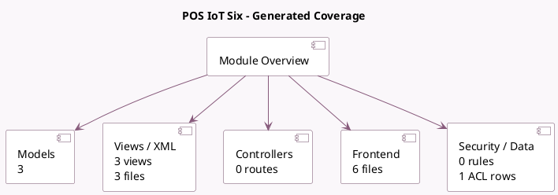

<!-- GENERATED:MODULE -->
---
tags: [odoo, enterprise, module]
---

# POS IoT Six

- Scope: Enterprise Addons
- Source: enterprise/pos_iot_six
- Dependencies: [[docs/Enterprise Addons/pos_iot/pos_iot|pos_iot]]

## Summary

Integrate your POS with a Six payment terminal through IoT

## Generated coverage

- Models: 3
- XML files with UI/data artifacts: 3
- Views: 3
- Actions: 1
- Menus: 0
- Rules (ir.rule): 0
- Access CSV entries: 1
- Controller units: 0
- Frontend asset files: 6

## Module map

## Detail notes

- Models: [[docs/Enterprise Addons/pos_iot_six/Models|Models]] (3)
- Views and XML: [[docs/Enterprise Addons/pos_iot_six/Views|Views]] (3 files)
- Frontend: [[docs/Enterprise Addons/pos_iot_six/Frontend|Frontend]] (6 files)

## Key models

- `iot.box`
- `pos.payment.method`
- `pos_iot_six.add_six_terminal`

## Navigation

- [[../Enterprise Addons/Enterprise Addons|Back to scope]]
- [[../../docs/docs|Back to docs]]

<!-- GENERATED:MODULE -->

