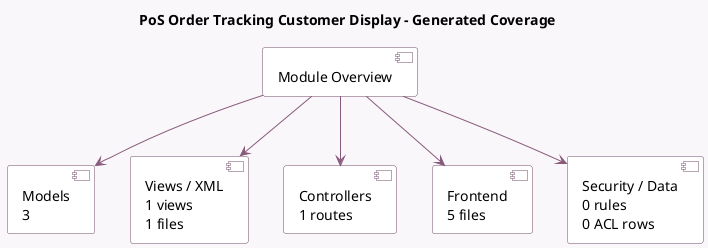

<!-- GENERATED:MODULE -->
---
tags: [odoo, enterprise, module]
---

# PoS Order Tracking Customer Display

- Scope: Enterprise Addons
- Source: enterprise/pos_order_tracking_display
- Dependencies: [[docs/Enterprise Addons/pos_enterprise/pos_enterprise|pos_enterprise]], [[docs/Community Addons/pos_self_order/pos_self_order|pos_self_order]]

## Summary

Display customer's order status

## Generated coverage

- Models: 3
- XML files with UI/data artifacts: 1
- Views: 1
- Actions: 0
- Menus: 0
- Rules (ir.rule): 0
- Access CSV entries: 0
- Controller units: 1
- Frontend asset files: 5

## Module map

## Detail notes

- Models: [[docs/Enterprise Addons/pos_order_tracking_display/Models|Models]] (3)
- Views and XML: [[docs/Enterprise Addons/pos_order_tracking_display/Views|Views]] (1 files)
- Controllers: [[docs/Enterprise Addons/pos_order_tracking_display/Controllers|Controllers]] (1)
- Frontend: [[docs/Enterprise Addons/pos_order_tracking_display/Frontend|Frontend]] (5 files)

## Key models

- `ir.http`
- `pos.prep.display`
- `pos.prep.state`

## Navigation

- [[../Enterprise Addons/Enterprise Addons|Back to scope]]
- [[../../docs/docs|Back to docs]]

<!-- GENERATED:MODULE -->

